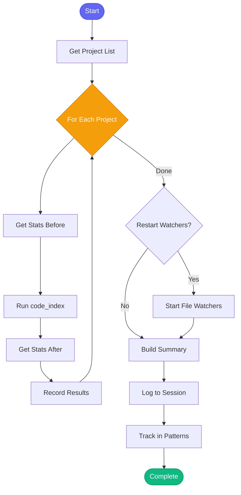

# 🔄 reindex_all_vectors

> Reindex all vector databases for semantic code search

## Overview

The `reindex_all_vectors` skill iterates through all configured projects and updates their vector indexes for semantic code search. It ensures that code embeddings are fresh and search results are accurate across your entire codebase.

Use this skill to:
- Keep all vector indexes fresh after code changes
- Ensure semantic search works across all projects
- Run as scheduled hourly maintenance via cron

## Quick Start

```text
skill_run("reindex_all_vectors", '{}')
```

Or use the Cursor command:

```text
/reindex-all-vectors
```

## Inputs

| Input | Type | Required | Default | Description |
|-------|------|----------|---------|-------------|
| `force` | boolean | No | `false` | Force full re-index of all files (not just changed) |
| `projects` | string | No | all | Comma-separated list of projects to reindex (empty = all) |
| `restart_watchers` | boolean | No | `true` | Restart file watchers after indexing for auto-updates |

## What It Does

1. **Gets Project List** - Reads all repositories from config.json with valid paths
2. **Reindexes Each Project** - For each project:
   - Gets stats before indexing
   - Runs incremental or full index based on `force` flag
   - Tracks files processed and chunks created
   - Gets stats after indexing
3. **Restarts Watchers** - Optionally restarts file watchers for automatic updates
4. **Reports Summary** - Provides detailed per-project statistics
5. **Tracks in Memory** - Records reindex for pattern analysis

## Flow



## Example Output

```markdown
## 🔄 Vector Reindex Complete

**Timestamp:** 2026-01-26 14:30:00 GMT

---

### 📊 Summary

- **Projects indexed:** 4 / 5
- **Total files processed:** 1,247
- **Total chunks created:** 8,932

### 📁 Project Details

| Project | Status | Files | Chunks | Index Type |
|---------|--------|-------|--------|------------|
| automation-analytics-backend | ✅ | 342 | 2,456 | IVF_FLAT |
| redhat-ai-workflow | ✅ | 589 | 4,123 | IVF_FLAT |
| app-interface | ✅ | 156 | 1,089 | FLAT |
| billing-service | ✅ | 160 | 1,264 | FLAT |
| missing-project | ❌ | - | - | Path not found... |

### ⏭️ Skipped Projects

- **old-deprecated**: Path not found: /home/user/src/old-deprecated

### 👁️ Watchers Started: 4

- ✅ automation-analytics-backend
- ✅ redhat-ai-workflow
- ✅ app-interface
- ✅ billing-service

---

*Use `code_stats()` to view detailed statistics.*
*Use `code_health()` to check vector search health.*
```

## Vector Index Storage

Vector indexes are stored in:

```
~/.cache/aa-workflow/vectors/
├── automation-analytics-backend/
│   ├── index.lance/
│   └── metadata.json
├── redhat-ai-workflow/
│   ├── index.lance/
│   └── metadata.json
└── ...
```

Each index contains:
- Code chunks with embeddings
- File metadata and timestamps
- Search statistics

## File Watchers

When `restart_watchers` is true, file watchers are started for each indexed project:

- Monitors for file changes in the project directory
- Uses debounce (default 5 seconds) to batch changes
- Automatically re-indexes changed files
- Runs in the background via async tasks

## MCP Tools Used

- `memory_session_log` - Log reindex to session
- Internal code search functions:
  - `_index_project` - Index a single project
  - `_get_index_stats` - Get index statistics
  - `start_watcher` - Start file change watcher

## Related Skills

- [knowledge_refresh](./knowledge_refresh.md) - Refresh knowledge for a single project
- [bootstrap_all_knowledge](./bootstrap_all_knowledge.md) - Bootstrap all project knowledge
- [learn_architecture](./learn_architecture.md) - Deep scan project architecture
- [find_similar_code](./find_similar_code.md) - Find similar code using vector search
