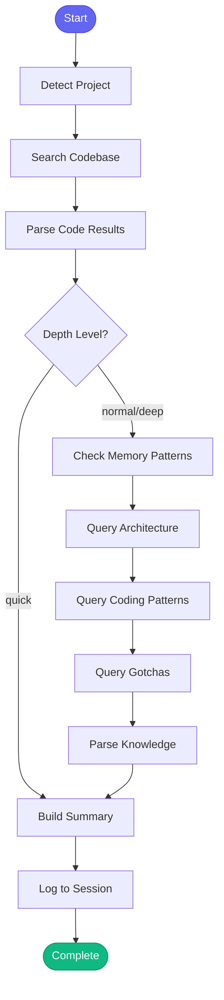

# :mag: research_topic

> Deep dive on a topic using internal and external sources

## Overview

The `research_topic` skill performs comprehensive research on any topic by combining multiple sources: semantic code search, memory patterns, project knowledge, and architecture context. Use this skill when you need to understand something thoroughly before taking action.

## Quick Start

```text
skill_run("research_topic", '{"topic": "pytest fixtures"}')
```

Or with focus and depth:

```text
skill_run("research_topic", '{"topic": "authentication", "focus": "security", "depth": "deep"}')
```

## Inputs

| Input | Type | Required | Default | Description |
|-------|------|----------|---------|-------------|
| `topic` | string | Yes | - | The topic to research (e.g., "pytest fixtures", "Redis caching", "authentication flow") |
| `project` | string | No | auto-detected | Project to search in |
| `depth` | string | No | `"normal"` | Research depth: `"quick"` (code only), `"normal"` (code + memory), `"deep"` (all sources) |
| `focus` | string | No | - | Specific aspect to focus on (e.g., "performance", "security", "testing") |

## What It Does

1. **Detect Project** - Auto-detects the project from current directory if not provided
2. **Search Codebase** - Performs semantic search for topic-related code
3. **Parse Results** - Extracts file paths, scores, and code previews
4. **Check Memory** (normal/deep) - Searches learned patterns for relevant fixes and insights
5. **Query Architecture** (normal/deep) - Gets architecture context from project knowledge
6. **Query Patterns** (normal/deep) - Retrieves coding patterns relevant to the topic
7. **Query Gotchas** (normal/deep) - Finds gotchas that might apply
8. **Build Summary** - Compiles findings into a structured research report
9. **Log Session** - Records the research in session history

## Depth Levels

| Depth | Sources Searched | Use Case |
|-------|-----------------|----------|
| `quick` | Code only | Fast lookup, simple questions |
| `normal` | Code + memory + knowledge | Standard research |
| `deep` | All sources + detailed analysis | Major decisions, new features |

## Flow



## Example Output

```text
## :mag: Research: pytest fixtures

**Focus:** testing
**Project:** automation-analytics-backend
**Depth:** normal

### :file_folder: Code Found

- `tests/conftest.py`
  > @pytest.fixture def db_session(): """Create a test database session...
- `tests/test_api.py`
  > @pytest.fixture def client(app): return app.test_client()...
- `tests/fixtures/sample_data.py`
  > def create_test_organization(**kwargs): ...

### :brain: Past Learnings

**session scope fixtures** (testing)
- Meaning: Use session scope for expensive fixtures like database connections
- Fix: Add scope="session" to fixture decorator

### :building_construction: Architecture Context

The tests/ directory contains all unit and integration tests. Fixtures are
defined in conftest.py and shared across test modules...

### :books: Coding Patterns

- Use pytest fixtures instead of setUp/tearDown
- Prefer factory functions for test data creation
- Use `@pytest.mark.parametrize` for test variants

### :warning: Gotchas

- Avoid circular imports between test modules
- Session-scoped fixtures can cause test pollution

---
### :bulb: Next Steps

- Use **WebSearch** for external documentation if needed
- Use `explain_code` to dive deeper into specific files
- Use `plan_implementation` when ready to create an action plan
- Use `persona_load('developer')` when ready to implement
```

## MCP Tools Used

- `code_search` - Semantic search for topic-related code
- `memory_read` - Check for related patterns
- `knowledge_query` - Query architecture, patterns, and gotchas
- `memory_session_log` - Log research to session

## Use Cases

- **Understanding Features** - Research how a feature is implemented
- **Bug Investigation** - Find related code and known issues
- **New Development** - Learn patterns before implementing
- **Onboarding** - Explore unfamiliar parts of the codebase
- **Documentation** - Gather information for docs

## Related Skills

- [compare_options](./compare_options.md) - Compare multiple approaches
- [explain_code](./explain_code.md) - Deep dive into specific files
- [gather_context](./gather_context.md) - Quick context gathering
- [plan_implementation](./plan_implementation.md) - Create action plan from research
