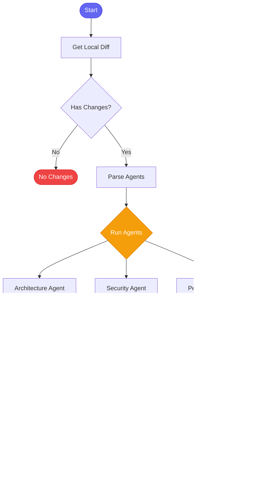

# :mag: review_local_changes

> Multi-agent code review for local uncommitted/staged changes - no GitLab MR required

## Overview

The `review_local_changes` skill provides comprehensive code review for local changes before committing or pushing. It uses a hybrid multi-agent approach with Claude and Gemini to analyze your code from multiple perspectives, catching issues early in the development cycle.

**Review Agents (Hybrid Claude + Gemini):**
- :building_construction: **Architecture Agent** (Claude): Design patterns, SOLID principles, separation of concerns
- :lock: **Security Agent** (Gemini): Security vulnerabilities, auth issues, data exposure
- :zap: **Performance Agent** (Claude): Performance bottlenecks, algorithmic complexity
- :test_tube: **Testing Agent** (Gemini): Test coverage, edge cases, error handling
- :memo: **Documentation Agent** (Claude): Code comments, docstrings, API docs
- :art: **Style Agent** (Gemini): Naming conventions, formatting, readability

## Quick Start

```bash
# Review staged changes (default)
skill_run("review_local_changes")

# Or use the Cursor command
/review-local-changes
```

## Usage

```bash
# Review only staged changes (git diff --cached)
skill_run("review_local_changes", '{"mode": "staged"}')

# Review all uncommitted changes (git diff HEAD)
skill_run("review_local_changes", '{"mode": "all"}')

# Review unstaged changes only (git diff)
skill_run("review_local_changes", '{"mode": "unstaged"}')

# Review changes since branching from main
skill_run("review_local_changes", '{"mode": "branch"}')

# Review a specific commit
skill_run("review_local_changes", '{"mode": "commit", "commit_sha": "abc123"}')

# Select specific agents
skill_run("review_local_changes", '{"agents": "security,performance"}')

# Review specific files only
skill_run("review_local_changes", '{"files": "src/api.py,src/models.py"}')
```

## Parameters

| Parameter | Type | Required | Default | Description |
|-----------|------|----------|---------|-------------|
| `mode` | string | No | `staged` | What to review: `staged`, `unstaged`, `all`, `commit`, `branch` |
| `commit_sha` | string | No | - | Commit SHA to review (only for `mode=commit`) |
| `base_branch` | string | No | `main` | Base branch for `mode=branch` comparison |
| `repo` | string | No | `.` | Repository path to review |
| `agents` | string | No | `architecture,security,performance` | Comma-separated list of agents to run |
| `model` | string | No | `sonnet` | Model to use (`sonnet`, `opus`, `haiku`) |
| `files` | string | No | - | Specific files to review (comma-separated) |

## What It Does

1. **Get Local Diff** - Retrieves the diff based on the specified mode
2. **Check for Changes** - Verifies there are changes to review
3. **Parse Agents** - Configures the enabled review agents
4. **Run Agents in Parallel** - Each agent reviews the code concurrently
5. **Synthesize Review** - Combines all agent findings into a cohesive review
6. **Build Output** - Formats the final review with verdict

## Review Modes

| Mode | Command | Description |
|------|---------|-------------|
| `staged` | `git diff --cached` | Review only staged changes (default) |
| `unstaged` | `git diff` | Review only unstaged changes |
| `all` | `git diff HEAD` | Review all uncommitted changes |
| `commit` | `git show <sha>` | Review a specific commit |
| `branch` | `git diff main...HEAD` | Review changes since branching |

## Verdicts

The skill returns one of three verdicts:

| Verdict | Meaning | Action |
|---------|---------|--------|
| **PASS** | No critical issues or warnings | Ready to commit/push |
| **WARN** | Warnings found, no critical issues | Consider addressing before push |
| **BLOCK** | Critical issues found | Fix before committing |

## Example Output

```text
## Local Code Review

**Mode:** `staged`
**Lines:** 156
**Verdict:** WARN

### Changes
 src/api/billing.py | 45 +++++++++---
 src/models/user.py | 12 ++-
 2 files changed, 48 insertions(+), 9 deletions(-)

### Review

## Review: WARN

I found one potential issue that should be addressed:

[WARNING] The new billing calculation in `calculate_total()` doesn't handle
the edge case where `quantity` is zero. Consider adding validation:

```python
if quantity <= 0:
    raise ValueError("Quantity must be positive")
```

Otherwise, the code looks good. The changes follow the existing patterns
and the separation of concerns is maintained.

---

### Agent Results
- **architecture** (claude): OK
- **security** (gemini): OK
- **performance** (claude): OK

---
Consider addressing warnings before push
```

## Process Flow



## MCP Tools Used

- `memory_session_log` - Log review to session history

## Related Skills

- [review_pr_multiagent](./review_pr_multiagent.md) - Multi-agent review for GitLab MRs
- [review_pr](./review_pr.md) - Quick single-agent MR review
- [review_all_prs](./review_all_prs.md) - Batch review all open MRs

## See Also

- [Developer Persona](../personas/developer.md)
- [Git Tools](../tool-modules/git.md)
