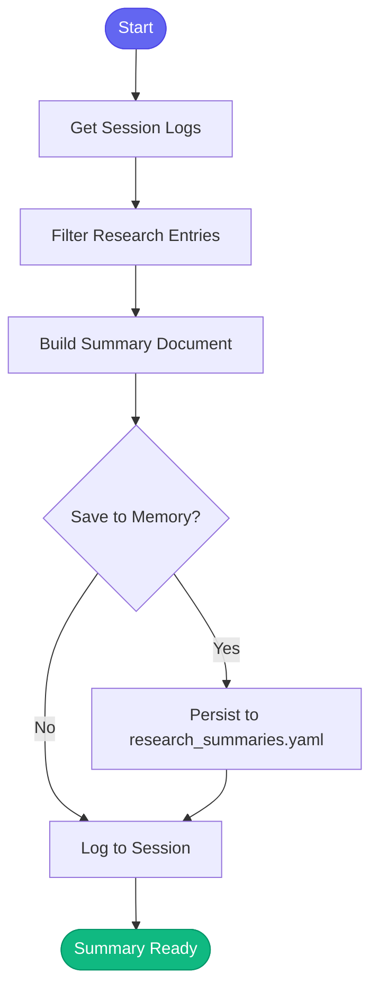

# 📄 summarize_findings

> Create summaries of research findings from a session

## Overview

The `summarize_findings` skill compiles research activities from your current session into a structured summary document. It reviews session logs, extracts research-related entries, and creates a formatted summary with space for key findings, conclusions, and next steps.

Use this skill at the end of a research session to capture learnings for future reference.

## Quick Start

```text
skill_run("summarize_findings", '{"topic": "caching strategies"}')
```

Or use the Cursor command:

```text
/summarize-findings topic="caching strategies"
```

## Inputs

| Input | Type | Required | Default | Description |
|-------|------|----------|---------|-------------|
| `topic` | string | Yes | - | Topic of the research (e.g., "caching strategies") |
| `conclusion` | string | No | - | Your conclusion or recommendation |
| `save_to_memory` | boolean | No | `true` | Save summary to memory for future reference |

## What It Does

1. **Gets Session Logs** - Reads today's session log entries
2. **Filters Research Entries** - Identifies research-related actions (search, compare, explain, plan)
3. **Builds Summary Document** - Creates structured markdown with:
   - Date and topic
   - Research activity timeline
   - Conclusion (if provided)
   - Placeholders for key findings
   - Next steps section
   - References section
4. **Saves to Memory** - Optionally persists summary for future reference
5. **Logs to Session** - Records the summary creation

## Flow



## Example Output

```markdown
## 📄 Research Summary: caching strategies

**Date:** 2026-01-26 14:30

### 📋 Research Activity

- **10:15** - Started research on caching patterns
  - Searched for Redis implementation examples
- **10:32** - Compared caching libraries
  - Evaluated redis vs memcached vs in-memory
- **11:05** - Explained cache invalidation strategies
  - Reviewed TTL-based vs event-based approaches

### 💡 Conclusion

Redis with TTL-based invalidation is the best fit for our use case.
Event-based invalidation can be added later for critical paths.

### 🔑 Key Findings

*Add key findings from your research:*
1.
2.
3.

### ➡️ Next Steps

*What should happen next?*
- [ ]

### 📚 References

*Add links to documentation, files, or resources:*
-

---
*Summary saved to memory for future reference.*
```

## Memory Storage

When `save_to_memory` is true, summaries are saved to:

```
memory/learned/research_summaries.yaml
```

The file contains:
- `summaries`: List of up to 50 recent summaries
- `last_updated`: Timestamp of last update

Each summary entry includes:
- `topic`: Research topic
- `date`: ISO timestamp
- `conclusion`: Your conclusion (if provided)
- `activity_count`: Number of research activities found

## MCP Tools Used

- `memory_session_log` - Log summary creation to session

## Related Skills

- [research_topic](./research_topic.md) - Deep dive research on a topic
- [compare_options](./compare_options.md) - Compare multiple approaches
- [plan_implementation](./plan_implementation.md) - Create implementation plan from findings
- [explain_code](./explain_code.md) - Explain code snippets
