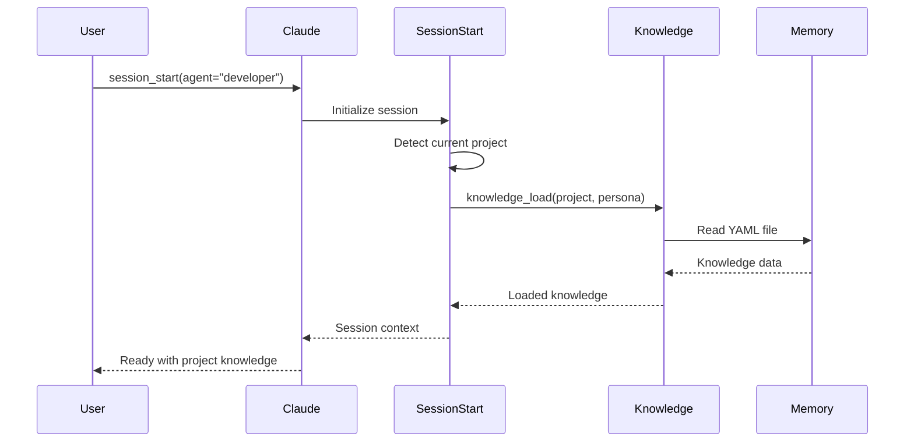
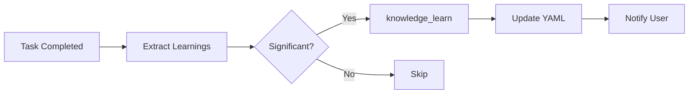
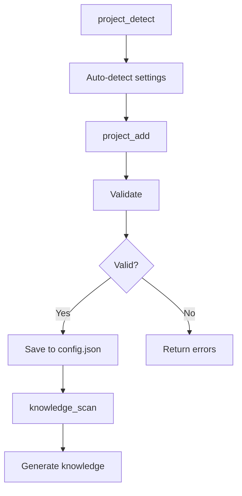

# Context Engineering: Knowledge & Project Management

> **Purpose**: Explain the new Knowledge Layer and Project Management features  
> **Duration**: 15-20 minutes  
> **Audience**: Developers using AI Workflow

---

## Part 1: The Context Engineering Challenge

### Slide 1: Title Slide

**Title**: Context Engineering: Beyond Prompt Engineering

**Subtitle**: Managing AI context for consistent, repeatable outcomes

> **Speaker Notes**: We've all heard of prompt engineering - crafting better prompts for better results. But there's another dimension: context engineering. How do we manage what the AI knows before it even starts working?

---

### Slide 2: Prompt vs Context Engineering

**Title**: Two Dimensions of AI Optimization

**Key Points**:
- **Prompt Engineering**: Crafting better instructions for each task
- **Context Engineering**: Managing what the AI knows before the task
- Both are essential for consistent outcomes
- We've been doing both - tools, skills, memory, personas

**Visual**: Two axes diagram - Prompt Quality vs Context Quality

| Dimension | What It Controls | Our Solution |
|-----------|-----------------|--------------|
| Prompt | Task instructions | Skills (YAML workflows) |
| Context | Background knowledge | Memory + Knowledge Layer |

> **Speaker Notes**: Prompt engineering is about asking better questions. Context engineering is about ensuring the AI has the right background knowledge. We've been doing both - skills handle prompts, memory handles context. Now we're adding a knowledge layer.

---

### Slide 3: The Context Window

**Title**: Understanding the Context Window

**Key Points**:
- Claude has ~128K-200K token context window
- Everything the AI "knows" must fit in this window
- Includes: System prompt, tools, memory, user messages, file contents

**Visual**: Context window breakdown

```
┌─────────────────────────────────────────────────────────────┐
│                    CONTEXT WINDOW (~200K tokens)             │
├─────────────────────────────────────────────────────────────┤
│  CLAUDE.md + Rules           ~2,000 tokens                  │
│  Tool Signatures (74 tools)  ~3,000 tokens                  │
│  Memory State                ~200 tokens                    │
│  Knowledge (NEW)             ~400 tokens                    │
│  ─────────────────────────────────────────                  │
│  Baseline Total:             ~5,600 tokens (3% of window)   │
│                                                             │
│  Task Context (files, messages) ~10,000-50,000 tokens       │
│  Remaining for reasoning:       ~140,000+ tokens            │
└─────────────────────────────────────────────────────────────┘
```

> **Speaker Notes**: The context window is finite but large. Our baseline - rules, tools, memory - uses only about 3% of available space. We have plenty of room for knowledge without crowding out task context.

---

### Slide 4: What We Already Manage

**Title**: Current Context Management

**Key Points**:
- **Personas (fastmcp)**: Control which tools are loaded (~74-91 tools)
- **Memory**: Persist state across sessions
- **Skills**: Encode best practices into workflows
- **Auto-heal**: Learn from failures

**Visual**: Current architecture

```
┌─────────────────────────────────────────────────────────────┐
│                    Claude Session                            │
├─────────────────────────────────────────────────────────────┤
│  PERSONAS          SKILLS           MEMORY                   │
│  Tool profiles     Workflows        State persistence        │
│  ~74-91 tools      55 skills        current_work.yaml       │
│  30% reduction     Best practices   learned/patterns.yaml   │
├─────────────────────────────────────────────────────────────┤
│  MISSING: Project-specific knowledge per persona             │
└─────────────────────────────────────────────────────────────┘
```

> **Speaker Notes**: We already manage context well - personas reduce tool count by 30%, skills encode workflows, memory persists state. But we're missing project-specific knowledge that varies by persona.

---

## Part 2: The Knowledge Layer

### Slide 5: Introducing the Knowledge Layer

**Title**: The Knowledge Layer

**Key Points**:
- Project-specific knowledge per persona
- Architecture, patterns, gotchas, testing approaches
- Auto-loaded at session start
- AI builds and maintains it

**Visual**: Knowledge structure

```
memory/knowledge/
└── personas/
    ├── developer/
    │   └── automation-analytics-backend.yaml
    ├── devops/
    │   └── automation-analytics-backend.yaml
    ├── tester/
    │   └── automation-analytics-backend.yaml
    └── release/
        └── automation-analytics-backend.yaml
```

> **Speaker Notes**: The knowledge layer adds project-specific context that varies by persona. A developer needs to know about code patterns. A devops engineer needs deployment details. Same project, different knowledge.

---

### Slide 6: Knowledge Schema

**Title**: What Knowledge Contains

**Developer Knowledge**:

```yaml
architecture:
  framework: FastAPI
  database: PostgreSQL
  orm: SQLAlchemy
  cache: Redis

patterns:
  api: "RESTful with OpenAPI"
  auth: "JWT with refresh tokens"
  testing: "pytest-asyncio, factories"

gotchas:
  - "Always use UTC for timestamps"
  - "Redis keys expire after 24h"
  - "Run migrations before tests"
```

**DevOps Knowledge**:

```yaml
deployment:
  platform: Konflux
  namespace: aap-aa-tenant
  
ephemeral:
  clowdapp: tower-analytics-clowdapp
  image_base: quay.io/redhat-user-workloads/...
```

> **Speaker Notes**: Each persona gets different knowledge. Developers see code patterns and gotchas. DevOps sees deployment details. The schema is flexible - whatever helps that persona be effective.

---

### Slide 7: Build vs Pre-load Trade-off

**Title**: The Build vs Pre-load Trade-off

**Without Pre-loaded Knowledge**:

```
User: "Add a new API endpoint"

AI: [reads directory structure]      ← 1 tool call
AI: [reads existing endpoint]        ← 1 tool call  
AI: [reads test file]                ← 1 tool call
AI: [reads conftest.py]              ← 1 tool call
AI: [makes changes]
AI: [runs tests, hits UTC gotcha]    ← Failure!
AI: [fixes, runs again]              ← Retry
```

**With Pre-loaded Knowledge**:

```
User: "Add a new API endpoint"

AI: [already knows: FastAPI, SQLAlchemy, pytest, UTC timestamps]
AI: [makes changes following known patterns]
AI: [runs tests]                     ← Success!
```

**Time saved**: 3-5 minutes per task

> **Speaker Notes**: Without knowledge, the AI has to rediscover patterns every time. With knowledge, it starts with understanding. The gotchas section is especially valuable - prevents hitting the same issues repeatedly.

---

### Slide 8: Auto-Loading at Session Start

**Title**: Automatic Knowledge Loading

**How It Works**:

```python
session_start(agent="developer")

# 1. Detect current project from working directory
project = detect_current_project()  # "automation-analytics-backend"

# 2. Get current persona
persona = "developer"

# 3. Load knowledge
knowledge = knowledge_load(project, persona)

# 4. If no knowledge exists, prompt to scan
if not knowledge:
    "No knowledge found. Run knowledge_scan() to generate."
```

**Result**: Context is ready before you ask your first question

> **Speaker Notes**: Knowledge loading is automatic. When you start a session, we detect your project and persona, then load the relevant knowledge. If none exists, we prompt you to generate it. Zero manual effort.

---

### Slide 9: Knowledge Tools

**Title**: Knowledge Management Tools

| Tool | Purpose |
|------|---------|
| `knowledge_load(project, persona)` | Load knowledge into context |
| `knowledge_scan(project, persona)` | Scan project and generate knowledge |
| `knowledge_update(section, content)` | Update specific sections |
| `knowledge_learn(learning, task)` | Record learnings from tasks |
| `knowledge_list()` | List available knowledge files |

**Skills**:

| Skill | Purpose |
|-------|---------|
| `bootstrap_knowledge` | Full scan for all personas |
| `learn_architecture` | Deep architecture analysis |

> **Speaker Notes**: We have tools for every knowledge operation. Scan to generate, load to use, update to refine, learn to capture insights. The bootstrap skill generates knowledge for all personas at once.

---

### Slide 10: Continuous Learning

**Title**: AI Builds Its Own Knowledge

**Key Points**:
- AI scans project to generate initial knowledge
- Learnings captured during task completion
- Notifications when knowledge is updated
- Human reviews significant changes

**Flow**:

```
┌─────────────┐    ┌─────────────┐    ┌─────────────┐
│   Task      │ -> │  Learning   │ -> │  Knowledge  │
│ Completed   │    │  Extracted  │    │  Updated    │
└─────────────┘    └─────────────┘    └─────────────┘
                          │
                          ▼
                   ┌─────────────┐
                   │ Notification│
                   │   to User   │
                   └─────────────┘
```

> **Speaker Notes**: The AI doesn't just consume knowledge - it builds it. When completing tasks, learnings are extracted and saved. You get notified of significant updates. Over time, the knowledge base grows automatically.

---

## Part 3: Project Management

### Slide 11: Managing Projects in config.json

**Title**: Project Management

**The Problem**:
- Projects defined in config.json
- Manual editing is error-prone
- Settings need to be detected, not guessed

**The Solution**: Project management tools

| Tool | Purpose |
|------|---------|
| `project_list()` | List all configured projects |
| `project_detect(path)` | Auto-detect project settings |
| `project_add(...)` | Add a new project |
| `project_update(...)` | Update project settings |
| `project_remove(...)` | Remove a project |

> **Speaker Notes**: We now have tools to manage projects in config.json. No more manual editing. The tools auto-detect settings from the project directory - language, branch, lint commands, test commands.

---

### Slide 12: Auto-Detection

**Title**: Auto-Detection of Project Settings

**What Gets Detected**:

| Setting | Detection Method |
|---------|-----------------|
| Language | pyproject.toml, package.json, go.mod |
| Default branch | git symbolic-ref refs/remotes/origin/HEAD |
| GitLab remote | git remote get-url origin |
| Lint command | Config files (black, flake8, eslint) |
| Test command | Test framework detection |
| Scopes | Directory structure |

**Example**:

```bash
project_detect(path="/home/user/src/new-project")

# Output:
# Language: python
# Default Branch: main
# GitLab: myorg/new-project
# Lint Command: black --check . && flake8 .
# Test Command: pytest tests/ -v
# Scopes: api, core, tests, utils
```

> **Speaker Notes**: Auto-detection examines the project directory and figures out settings automatically. It checks for config files, git remotes, directory structure. You just confirm and add.

---

### Slide 13: The add_project Skill

**Title**: Adding a Project - Full Workflow

**Skill Steps**:

```
1. detect_settings    → Auto-detect from directory
2. validate_path      → Verify path exists
3. get_project_name   → Determine project name
4. check_gitlab_access → Verify GitLab is accessible
5. check_jira_access  → Verify Jira project exists
6. add_project        → Add to config.json
7. setup_quay_repo    → Configure Quay (optional)
8. setup_bonfire_app  → Configure Bonfire (optional)
9. generate_knowledge → Scan and generate knowledge
10. summary           → Show what was done
```

**Usage**:

```bash
skill_run("add_project", '{
    "path": "/home/user/src/new-service",
    "jira_project": "AAP",
    "generate_knowledge": true
}')
```

> **Speaker Notes**: The add_project skill handles the complete workflow. It detects settings, validates access, adds to config, and optionally generates knowledge. One command to onboard a new project.

---

## Part 4: Cursor Commands

### Slide 14: New Slash Commands

**Title**: 11 New Slash Commands

**Knowledge Commands**:

| Command | Purpose |
|---------|---------|
| `/knowledge-scan` | Scan project for knowledge |
| `/knowledge-load` | Load knowledge into context |
| `/knowledge-update` | Update specific sections |
| `/knowledge-learn` | Record learnings |
| `/knowledge-list` | List knowledge files |
| `/bootstrap-knowledge` | Full knowledge generation |
| `/learn-architecture` | Deep architecture scan |

**Project Commands**:

| Command | Purpose |
|---------|---------|
| `/add-project` | Add project to config |
| `/list-projects` | List configured projects |
| `/detect-project` | Auto-detect settings |
| `/remove-project` | Remove project |

> **Speaker Notes**: All features are accessible via slash commands. Type /knowledge or /project to see options. Commands are documented in .cursor/commands/ directory.

---

### Slide 15: VSCode Extension Updates

**Title**: Dynamic Skill Detection

**Key Points**:
- Extension now reads skill tags from YAML
- Skills auto-categorized by tags or name patterns
- New categories: Knowledge, Project
- Icons inferred from skill names

**Before**: Hardcoded skill lists
**After**: Dynamic detection from skills/ directory

**New Categories**:

| Category | Icon | Skills |
|----------|------|--------|
| Knowledge | 📚 | bootstrap_knowledge, learn_architecture |
| Project | 📁 | add_project |

> **Speaker Notes**: The VSCode extension now dynamically detects skills. No more manual updates when adding new skills. It reads tags from YAML files and categorizes automatically.

---

## Part 5: Summary

### Slide 16: The Complete Picture

**Title**: Context Engineering - The Complete Picture

**Visual**: Full architecture

```
┌─────────────────────────────────────────────────────────────┐
│                    Claude Session                            │
├─────────────────────────────────────────────────────────────┤
│  PERSONAS          SKILLS           MEMORY                   │
│  Tool profiles     Workflows        State persistence        │
│  ~74-91 tools      55+ skills       current_work.yaml       │
├─────────────────────────────────────────────────────────────┤
│  KNOWLEDGE (NEW)                                             │
│  Project-specific context per persona                        │
│  memory/knowledge/personas/{persona}/{project}.yaml         │
├─────────────────────────────────────────────────────────────┤
│  PROJECT MANAGEMENT (NEW)                                    │
│  Auto-detect and manage projects in config.json             │
│  project_add, project_detect, project_list                  │
└─────────────────────────────────────────────────────────────┘
```

> **Speaker Notes**: We now have a complete context engineering solution. Personas control tools. Skills encode workflows. Memory persists state. Knowledge provides project understanding. Project management keeps config.json accurate.

---

### Slide 17: Key Takeaways

**Title**: Key Takeaways

**Key Points**:
- Context engineering is as important as prompt engineering
- Pre-loaded knowledge saves time and prevents errors
- AI builds and maintains its own knowledge
- Project management tools eliminate manual config editing
- Everything is accessible via slash commands

**The Result**:
- More consistent AI behavior
- Fewer repeated mistakes
- Faster task completion
- Self-improving system

> **Speaker Notes**: Context engineering ensures the AI starts each task with the right background. Combined with prompt engineering via skills, we get consistent, reliable outcomes. The system improves itself over time.

---

### Slide 18: Getting Started

**Title**: Getting Started

**Generate Knowledge for Your Project**:

```bash
# Scan current project
knowledge_scan()

# Or full bootstrap for all personas
skill_run("bootstrap_knowledge", '{"project": "my-project"}')
```

**Add a New Project**:

```bash
# Detect and add
project_detect(path="/path/to/project")
project_add(name="my-project", path="/path", gitlab="org/repo", jira_project="AAP")

# Or use the skill
skill_run("add_project", '{"path": "/path/to/project", "jira_project": "AAP"}')
```

**Resources**:
- `/knowledge-list` - See available knowledge
- `/list-projects` - See configured projects
- `docs/commands/project_tools.md` - Full documentation

> **Speaker Notes**: Getting started is easy. Run knowledge_scan to generate knowledge for your current project. Use project_add to onboard new projects. Everything is documented in the commands reference.

---

## Appendix: Mermaid Diagrams

### Diagram 1: Knowledge Loading Flow



---

### Diagram 2: Knowledge Update Flow



---

### Diagram 3: Project Add Flow


