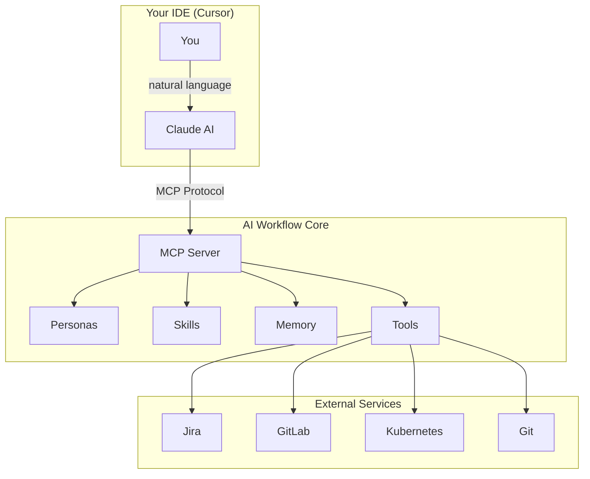
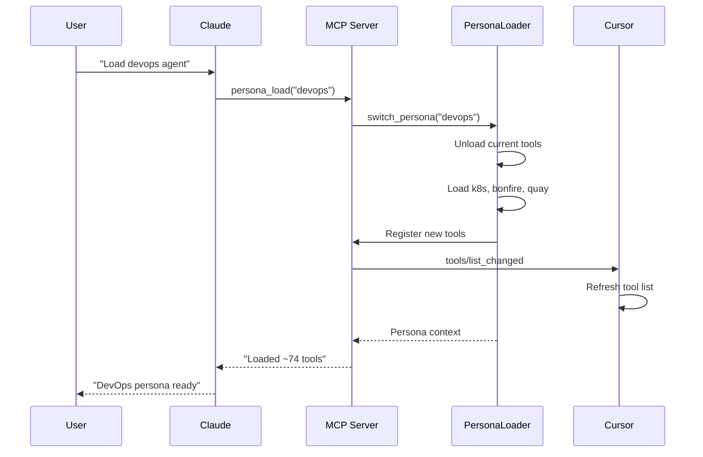
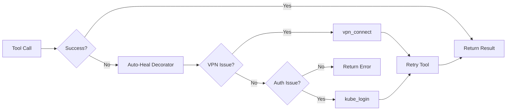
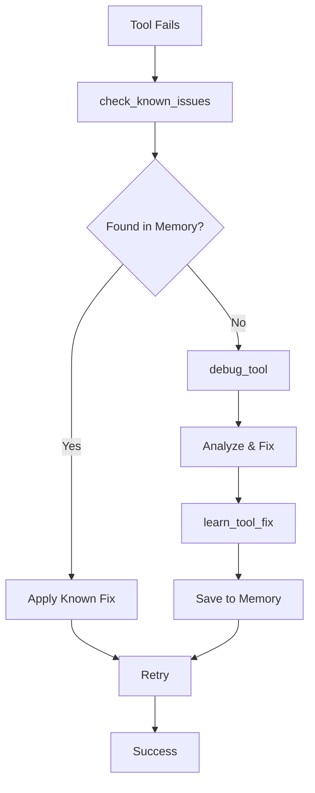
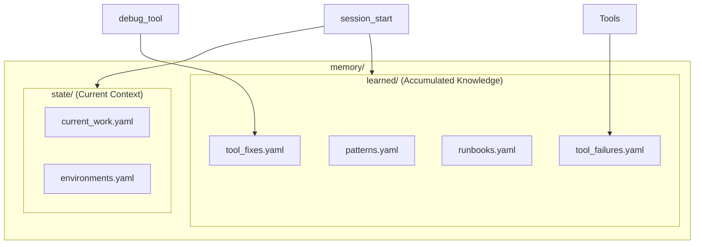
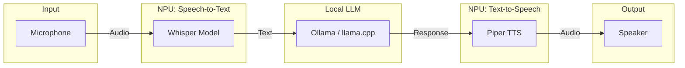

# AI Workflow Engineer Onboarding Slides

> **Purpose**: Content outline for Google Slides presentation  
> **Duration**: 30-45 minutes  
> **Audience**: Mixed (some AI experience, some new)

---

## Part 1: AI Foundations

### Slide 1: Title Slide

**Title**: AI Workflow: Your AI-Powered Development Command Center

**Subtitle**: Transform Claude into your personal DevOps engineer, developer assistant, and incident responder

**Visual**: Project logo or hero image with icons representing Git, Jira, Kubernetes, Slack

> **Speaker Notes**: Welcome engineers to the AI Workflow onboarding. This system gives Claude AI the ability to actually DO things - not just answer questions, but execute actions across your entire development stack.

---

### Slide 2: What is an AI Assistant?

**Title**: What is an AI Assistant?

**Key Points**:
- Large Language Models (LLMs) - trained on vast amounts of text
- Context Window - the "working memory" (~200K tokens for Claude)
- Stateless by default - forgets everything between sessions
- Great at understanding, reasoning, and generating text

**Visual**: Simple diagram showing Input -> LLM -> Output

> **Speaker Notes**: Before we dive into the project, let's establish a baseline. An LLM like Claude is essentially a very sophisticated pattern matching system trained on text. It can understand context, reason about problems, and generate responses. But out of the box, it has limitations - it forgets between sessions and can only talk, not act.

---

### Slide 3: Basic Prompting

**Title**: Basic Prompting - Where Everyone Starts

**Examples**:

```
Bad Prompt:
"Fix the bug"

Better Prompt:
"The login page shows a 500 error when submitting 
the form. The error logs show a NullPointerException 
in AuthService.java line 45. How do I fix this?"
```

**Key Points**:
- More context = better answers
- Be specific about what you want
- Include relevant error messages, file names, versions

> **Speaker Notes**: Most people start here - asking questions in natural language. The quality of the response directly correlates to the quality of the prompt. Vague prompts get vague answers. This works, but it's inefficient for repeated tasks.

---

### Slide 4: Better Prompting - Structure and Context

**Title**: Better Prompting - Structure Matters

**Structured Prompt Template**:

```
ROLE: You are a senior Python developer
CONTEXT: Working on a Django REST API
TASK: Review this authentication code
CONSTRAINTS: Must be compatible with Python 3.10+
FORMAT: Bullet points with code examples
```

**Key Points**:
- Role setting focuses the model
- Context provides relevant background
- Constraints narrow the solution space
- Format specifies desired output structure

> **Speaker Notes**: Experienced users learn to structure their prompts. By setting a role, providing context, defining constraints, and specifying output format, you get much more useful responses. But this takes effort every time.

---

### Slide 5: Prompt Databases / Slash Commands

**Title**: Prompt Databases - Consistency at Scale

**The Problem**: Writing good prompts is time-consuming and inconsistent

**The Solution**: Pre-built, tested prompts as slash commands

**Examples from AI Workflow (66 commands)**:

| Command | What It Does |
|---------|--------------|
| `/coffee` | Morning briefing - email, PRs, Jira, calendar |
| `/start-work AAP-12345` | Begin work on a Jira issue |
| `/create-mr` | Create MR with validation |
| `/deploy-ephemeral` | Deploy to test environment |
| `/investigate-alert` | Triage production alerts |

**Visual**: Screenshot of slash command picker in Cursor

> **Speaker Notes**: Prompt databases solve the consistency problem. Instead of crafting prompts each time, you use pre-built commands. We have 66 slash commands covering daily workflows, development, review, deployment, and incident response. Same quality every time, no effort required.

---

### Slide 6: From Prompts to Actions

**Title**: From Prompts to Actions - The Gap

**The Limitation**:
- AI can explain HOW to create a Git branch
- But it can't actually CREATE the branch
- AI can describe Kubernetes pod status
- But it can't actually QUERY the cluster

**The Solution**: MCP (Model Context Protocol)
- Standardized way to give AI tools
- AI can call functions, not just generate text
- Turns conversation into action

**Visual**: Diagram showing Prompt-Only vs MCP-Enabled Claude

```
Before MCP:                    After MCP:
User -> Claude -> Text         User -> Claude -> MCP -> Action
"How do I..."  -> Instructions "Create branch" -> git_branch_create()
                                                  -> Branch created!
```

> **Speaker Notes**: This is the key insight. Traditional AI can only talk - it explains how to do things but can't do them itself. MCP bridges this gap by giving Claude access to tools - functions it can call to take real action. This transforms Claude from an advisor into an executor.

---

## Part 2: Why Personas Over Multiple Agents

### Slide 7: Multi-Agent vs Single-Agent

**Title**: Multi-Agent Architectures - The Complexity

**Multi-Agent Approach**:
- Separate AI instances for each domain
- DevOps Agent, Developer Agent, Incident Agent
- Coordination layer required
- State synchronization challenges
- Higher costs (multiple API calls)

**Visual**: Complex diagram with multiple Claude instances, coordinators, message passing

```
       ┌─────────────┐
       │ Coordinator │
       └──────┬──────┘
    ┌─────────┼─────────┐
    ▼         ▼         ▼
┌───────┐ ┌───────┐ ┌───────┐
│DevOps │ │ Dev   │ │Incident│
│Agent  │ │Agent  │ │Agent   │
└───────┘ └───────┘ └───────┘
```

**Problems**:
- Who decides which agent handles a request?
- How do agents share context?
- What if a task spans multiple domains?

> **Speaker Notes**: The intuitive approach might be to create separate AI agents for each domain. But this creates significant complexity - you need coordination, state sharing, and handoff logic. It's expensive and error-prone.

---

### Slide 8: The 80-Tool Limit Problem

**Title**: The 80-Tool Limit Problem

**The Reality**:
- Cursor IDE has a ~128 tool limit
- Practical limit is closer to 80 tools
- We have 263 tools across 16 modules!
- Loading all tools would exceed limits and flood context

**Why It Matters**:
- Each tool takes up context window space
- Too many tools = confused model
- Tool descriptions add up quickly

**Visual**: Bar chart showing tool counts by module

| Module | Tools |
|--------|-------|
| git | 30 |
| gitlab | 30 |
| jira | 28 |
| k8s | 28 |
| konflux | 35 |
| bonfire | 20 |
| ... | ... |
| **Total** | **263** |

> **Speaker Notes**: Here's a practical constraint - IDEs and Claude itself have limits on how many tools can be loaded. We have 263 tools, but we can only expose about 80 at a time. We need a way to dynamically select which tools are relevant.

---

### Slide 9: Solution - Dynamic Personas

**Title**: Solution - Dynamic Personas

**The Insight**: One Claude, Different "Hats"

**How It Works**:
- Single Claude instance (single-agent)
- Personas are tool configuration profiles
- "Loading an agent" = changing available tools
- No coordination complexity
- Instant context switching

**Visual**: Single Claude with interchangeable tool sets

```
            ┌─────────────────┐
            │     Claude      │
            │  (Single Agent) │
            └────────┬────────┘
                     │
        ┌────────────┼────────────┐
        ▼            ▼            ▼
   ┌─────────┐  ┌─────────┐  ┌─────────┐
   │Developer│  │ DevOps  │  │Incident │
   │ Tools   │  │ Tools   │  │ Tools   │
   └─────────┘  └─────────┘  └─────────┘
     ~78           ~74          ~78
```

> **Speaker Notes**: Our solution is elegant - instead of multiple agents, we have one Claude that can wear different hats. Each persona is just a different tool configuration. When you say "load DevOps agent," we swap out the developer tools for DevOps tools. Same AI, different capabilities.

---

### Slide 10: Persona Examples

**Title**: Available Personas

| Persona | Focus | Tool Count | Key Modules |
|---------|-------|------------|-------------|
| 👨‍💻 Developer | Coding, PRs | ~78 | git, gitlab, jira |
| 🔧 DevOps | Deployments, K8s | ~74 | k8s, bonfire, quay |
| 🚨 Incident | Production issues | ~78 | k8s, prometheus, alertmanager |
| 📦 Release | Shipping | ~91 | konflux, quay, git |
| 💬 Slack | Autonomous bot | ~85 | slack, jira, gitlab |

**All personas include**:
- Core workflow tools (memory, skills, session)
- Jira tools (issue tracking is universal)
- Auto-heal infrastructure

> **Speaker Notes**: We have five main personas, each optimized for a different workflow. Developer for day-to-day coding, DevOps for infrastructure work, Incident for production issues, Release for shipping, and Slack for our autonomous bot. All stay under the tool limit while providing focused capabilities.

---

### Slide 11: How Persona Loading Works

**Title**: How Persona Loading Works

**Sequence**:

```
1. User: "Load the devops agent"

2. Claude calls: persona_load("devops")

3. MCP Server:
   - Unloads current tools (git, gitlab, jira)
   - Loads new tools (k8s, bonfire, quay, jira)
   - Sends tools/list_changed notification

4. Cursor IDE:
   - Receives notification
   - Refreshes available tools

5. Claude: "🔧 DevOps persona loaded with ~74 tools"
```

**Visual**: Sequence diagram (mermaid source provided in appendix)

**Key Point**: Tools switch dynamically - no restart required!

> **Speaker Notes**: The loading process is seamless. You just ask Claude to load a different persona, and within seconds the tools swap out. The IDE gets notified and refreshes its tool list. You can switch between personas as often as needed without restarting anything.

---

## Part 3: Skills - Multi-Step Workflows

### Slide 12: What Are Skills?

**Title**: Skills - Reusable Multi-Step Workflows

**The Problem**:
- Many tasks require multiple tool calls in sequence
- "Start work on issue" = view issue + create branch + update status
- Manual orchestration is tedious and error-prone

**The Solution**: Skills
- YAML-defined workflows
- Chain multiple tools together
- Include conditions and branching
- Handle errors gracefully
- Template substitution (Jinja2)

**Visual**: Simple skill flow diagram

```
┌──────────────┐    ┌──────────────┐    ┌──────────────┐
│ jira_view    │ -> │ git_branch   │ -> │ jira_set     │
│ _issue       │    │ _create      │    │ _status      │
└──────────────┘    └──────────────┘    └──────────────┘
   Get details       Create branch      Mark "In Progress"
```

> **Speaker Notes**: Skills solve the orchestration problem. Instead of manually calling multiple tools, you define a workflow once and reuse it. Skills can include logic - if this fails, do that. They're defined in YAML so they're easy to read and modify.

---

### Slide 13: FastMCP Skill Engine

**Title**: FastMCP Skill Engine

**Capabilities**:
- **Templating**: `{{ inputs.issue_key }}` - Jinja2 syntax
- **Conditions**: `condition: "step1_result.success"`
- **Compute steps**: Python code for data transformation
- **Error handling**: `on_error: continue | fail | retry`
- **Outputs**: Pass data between steps

**Architecture**:

```
┌─────────────────────────────────────────┐
│           Skill YAML File               │
│  ┌─────┐  ┌─────┐  ┌─────┐  ┌─────┐   │
│  │Step1│->│Step2│->│Step3│->│Step4│   │
│  └─────┘  └─────┘  └─────┘  └─────┘   │
└─────────────────────────────────────────┘
                    │
                    ▼
┌─────────────────────────────────────────┐
│         FastMCP Skill Engine            │
│  - Template resolution                  │
│  - Condition evaluation                 │
│  - Tool execution                       │
│  - Error handling & retry               │
└─────────────────────────────────────────┘
                    │
                    ▼
┌─────────────────────────────────────────┐
│            MCP Tools                    │
│  jira_view_issue, git_branch_create...  │
└─────────────────────────────────────────┘
```

> **Speaker Notes**: The skill engine is built on FastMCP and provides powerful orchestration. Templates let you pass data between steps. Conditions let you branch based on results. Compute steps let you transform data with Python. Error handling ensures graceful failure.

---

### Slide 14: Example - start_work Skill

**Title**: Example: The start_work Skill

**What it does**:
1. Fetch Jira issue details
2. Generate branch name from issue key + summary
3. Create Git branch
4. Update Jira status to "In Progress"
5. Update memory with active work

**YAML snippet**:

```yaml
name: start_work
description: Begin working on a Jira issue

inputs:
  - name: issue_key
    type: string
    required: true

steps:
  - name: get_issue
    tool: jira_view_issue
    args:
      issue_key: "{{ inputs.issue_key }}"
    output: issue_data

  - name: create_branch
    tool: git_branch_create
    args:
      repo: "{{ inputs.repo }}"
      branch_name: "{{ issue_data.key | lower }}-{{ issue_data.summary | slugify }}"
    output: branch_result

  - name: update_status
    tool: jira_set_status
    args:
      issue_key: "{{ inputs.issue_key }}"
      status: "In Progress"
```

> **Speaker Notes**: Here's a concrete example. The start_work skill takes an issue key, fetches the details, generates a branch name, creates the branch, and updates Jira. All in one command. The YAML is readable and maintainable.

---

### Slide 15: 55 Production Skills

**Title**: 55 Production Skills

**Categories**:

| Category | Skills | Examples |
|----------|--------|----------|
| ☕ Daily Rituals | 4 | coffee, beer, standup_summary, weekly_summary |
| 💻 Development | 8 | start_work, create_mr, close_issue, sync_branch |
| 👀 Code Review | 6 | review_pr, check_my_prs, rebase_pr |
| 🧪 Testing | 6 | test_mr_ephemeral, deploy_to_ephemeral |
| 🚨 Incident | 5 | investigate_alert, debug_prod, silence_alert |
| 📋 Jira | 4 | create_jira_issue, jira_hygiene |
| 📦 Release | 4 | release_to_prod, konflux_status |
| 🔧 Utility | 18 | memory_*, learn_pattern |

**All production skills include auto-heal** for VPN and authentication issues

> **Speaker Notes**: We have 55 production-ready skills covering the full development lifecycle. From morning coffee briefings to end-of-day summaries, from starting work to releasing to production. Every skill is tested and includes automatic error recovery.

---

### Slide 16: Running Skills

**Title**: Three Ways to Run Skills

**1. Natural Language** (in chat):
```
Run the start_work skill for AAP-12345
```

**2. Tool Call** (explicit):
```python
skill_run("start_work", '{"issue_key": "AAP-12345"}')
```

**3. Slash Command** (in Cursor):
```
/start-work AAP-12345
```

**All three methods**:
- Execute the same skill
- Include auto-heal
- Update memory
- Return consistent results

> **Speaker Notes**: Skills are accessible in whatever way is most natural. In conversation, just describe what you want. For precision, use the tool call. For quick access, use slash commands. They all run the same underlying skill with the same reliability.

---

## Part 4: Auto-Remediation

### Slide 17: The Problem - Things Break

**Title**: The Problem - Things Break

**Common Failures**:

| Issue | Symptom | Cause |
|-------|---------|-------|
| VPN Disconnected | "No route to host" | Network timeout |
| Token Expired | "401 Unauthorized" | Auth expired |
| Rate Limited | "429 Too Many Requests" | API throttling |
| Cluster Unreachable | "Connection refused" | Wrong cluster/config |

**The Old Way**:
1. Tool fails
2. You read the error
3. You figure out what's wrong
4. You fix it manually
5. You retry

**Time wasted**: 2-5 minutes per failure

> **Speaker Notes**: Working with external systems means dealing with failures. VPN disconnects, tokens expire, services go down. Traditionally, you'd have to diagnose each failure and fix it manually. This wastes time and breaks your flow.

---

### Slide 18: Tool-Level Auto-Heal

**Title**: Tool-Level Auto-Heal

**How It Works**:

```
Tool Call → Failure → Detect Pattern → Apply Fix → Retry → Success
```

**Python Decorators**:

```python
from server.auto_heal_decorator import auto_heal_k8s

@registry.tool()
@auto_heal_k8s()
async def kubectl_get_pods(namespace: str, environment: str = "stage"):
    """Get pods - auto-heals VPN/auth failures."""
    # If this fails with auth/VPN issues, the decorator
    # automatically runs kube_login or vpn_connect and retries
    ...
```

**Available Decorators**:

| Decorator | Environment | Use Case |
|-----------|-------------|----------|
| `@auto_heal_ephemeral()` | Ephemeral | Bonfire tools |
| `@auto_heal_konflux()` | Konflux | Build pipelines |
| `@auto_heal_k8s()` | Stage/Prod | Kubectl tools |
| `@auto_heal_jira()` | - | Jira tools |
| `@auto_heal_git()` | - | Git/GitLab tools |

> **Speaker Notes**: Every tool in the system is wrapped with an auto-heal decorator. When a tool fails, the decorator checks the error pattern, applies the appropriate fix (VPN connect or kube login), and retries automatically. You don't even notice the failure.

---

### Slide 19: The Learning Loop

**Title**: The Learning Loop

**Flow**:

```
┌─────────────────────────────────────────────────────────────────┐
│                       Tool Execution                             │
├─────────────────────────────────────────────────────────────────┤
│                                                                  │
│  Tool executes...                                                │
│      ↓                                                           │
│  ❌ FAILS                                                        │
│      ↓                                                           │
│  check_known_issues(tool_name, error_text)                       │
│      ↓                                                           │
│  ┌──────────────────────────────────────────┐                    │
│  │ Checks:                                  │                    │
│  │  - memory/learned/tool_fixes.yaml        │                    │
│  │  - memory/learned/patterns.yaml          │                    │
│  └──────────────────────────────────────────┘                    │
│      ↓                                                           │
│  Known fix found? → Apply immediately                            │
│  New error? → debug_tool() → Fix → learn_tool_fix() → Save       │
│                                                                  │
└─────────────────────────────────────────────────────────────────┘
```

**Key Insight**: Fixes are remembered forever - the same mistake never happens twice!

> **Speaker Notes**: The learning loop ensures continuous improvement. When a tool fails, we first check if we've seen this error before. If yes, apply the known fix. If no, debug the issue, fix it, and save the fix for next time. Over time, the system gets smarter.

---

### Slide 20: debug_tool + learn_tool_fix

**Title**: Self-Debugging Tools

**debug_tool** - Analyze and fix a failing tool:

```python
debug_tool("bonfire_deploy", "manifest unknown: image not found")
```

Returns:
- Source file location
- Function code
- Step-by-step fix instructions
- Reminder to save the fix

**learn_tool_fix** - Save a fix permanently:

```python
learn_tool_fix(
    tool_name="bonfire_deploy",
    error_pattern="manifest unknown",
    root_cause="Short SHA doesn't exist in Quay",
    fix_description="Use full 40-char SHA instead of 8-char"
)
```

**Next time**: The fix appears automatically!

> **Speaker Notes**: These two tools enable self-healing at a deeper level. debug_tool lets Claude analyze its own source code to find bugs. learn_tool_fix saves that knowledge permanently. The AI literally fixes itself and remembers how.

---

### Slide 21: Coverage

**Title**: Auto-Heal Coverage

**All 263 tools have auto-heal decorators**:

| Module | Tools | Auto-Heal |
|--------|-------|-----------|
| Git tools | 30 | ✅ @auto_heal() |
| GitLab tools | 30 | ✅ @auto_heal() |
| Jira tools | 28 | ✅ @auto_heal() |
| K8s tools | 28 | ✅ @auto_heal_k8s() |
| Bonfire tools | 20 | ✅ @auto_heal_ephemeral() |
| Konflux tools | 35 | ✅ @auto_heal_konflux() |
| Prometheus tools | 13 | ✅ @auto_heal() |
| Alertmanager tools | 7 | ✅ @auto_heal() |
| ... | ... | ✅ |

**All 55 skills auto-retry** after fixes are applied

**Result**: Seamless experience even when infrastructure is flaky

> **Speaker Notes**: This isn't a partial solution - every single tool in the system has auto-heal. Every skill retries after fixes. The result is a remarkably resilient system that handles infrastructure issues transparently.

---

## Part 5: Memory - Consistency Across Sessions

### Slide 22: Why Memory Matters

**Title**: Why Memory Matters

**The Problem**:
- Claude is stateless by default
- Each session starts fresh
- Context is lost between conversations
- "What was I working on?" - You have to explain every time

**What We Need**:
- Track current work (issues, branches, MRs)
- Remember learned patterns
- Maintain session continuity
- Prevent repeated mistakes

**Visual**: Session 1 context being lost, Session 2 starting fresh

> **Speaker Notes**: By default, every Claude session is a blank slate. This is frustrating when you're in the middle of complex work. You shouldn't have to re-explain your context every time. Memory solves this by persisting important state.

---

### Slide 23: Memory Structure

**Title**: Memory Structure

**Two Categories**:

```
memory/
├── state/                    # Current work context
│   ├── current_work.yaml     # Active issues, branches, MRs
│   └── environments.yaml     # Stage/prod health status
│
└── learned/                  # Accumulated knowledge
    ├── patterns.yaml         # Error patterns & solutions
    ├── tool_fixes.yaml       # Tool-specific fixes
    ├── runbooks.yaml         # Procedures that worked
    └── tool_failures.yaml    # Auto-heal history
```

**State**: What you're working on right now  
**Learned**: Knowledge accumulated over time

**Visual**: Two boxes - "State (ephemeral)" and "Learned (permanent)"

> **Speaker Notes**: Memory is organized into two categories. State is your current work context - what you're working on today. Learned is accumulated knowledge - patterns and fixes discovered over time. Both persist across sessions.

---

### Slide 24: Session Continuity

**Title**: Session Continuity

**session_start()** - First thing every session:

```python
session_start(agent="developer")
```

**What It Loads**:
- ✅ Current work state (active issues, branches, MRs)
- ✅ Today's session history (if resuming)
- ✅ Learned patterns (count by category)
- ✅ Agent persona with tools

**Example Output**:

```
📋 Session Started
🧠 Learned Patterns: 12 patterns loaded
   - Jira CLI: 3 patterns
   - Error handling: 5 patterns
   - Authentication: 4 patterns
🛠️ Currently Loaded Tools: git, gitlab, jira (~78 tools)

📍 Current Work:
   - AAP-12345: In Progress (branch: aap-12345-feature)
   - MR !789: Pipeline passed, awaiting review
```

> **Speaker Notes**: session_start is the first tool you call. It loads your entire context - what you were working on, what patterns have been learned, which tools are available. You're immediately productive, no re-explanation needed.

---

### Slide 25: Error Prevention

**Title**: Error Prevention via Memory

**check_known_issues** - Proactive checking:

```python
# Before a risky operation
check_known_issues(tool_name="bonfire_deploy")

# After a failure
check_known_issues(error_text="manifest unknown")
```

**Output**:

```
## 💡 Known Issues Found!

**Previous fix for `bonfire_deploy`:**
- Pattern: `manifest unknown`
- Root cause: Short SHA doesn't exist in Quay
- **Fix:** Use full 40-char SHA instead of 8-char
```

**Memory Files Updated Automatically**:
- Failures logged with timestamps
- Success rates tracked
- Patterns deduplicated

> **Speaker Notes**: Memory isn't just for loading context - it actively prevents errors. Before risky operations, Claude can check for known issues. After failures, it can recall how we fixed this last time. The system gets smarter with every use.

---

## Part 6: Integrations

### Slide 26: Slack Bot Integration

**Title**: Slack Bot Integration

**Capabilities**:
- Monitor channels for queries and alerts
- Respond to natural language requests
- Investigate alerts automatically
- Create Jira issues from conversations
- D-Bus IPC for control

**Example Interaction**:

```
User: What's the status of AAP-12345?

Bot: 📋 *AAP-12345*: Implement caching layer
     Status: In Progress 🔄
     Assignee: @jsmith
     [View in Jira](link)
```

**Visual**: Screenshot of Slack conversation

> **Speaker Notes**: The Slack bot brings AI Workflow to where your team communicates. It monitors channels, understands intent, and responds using the same tools and skills. You can check Jira status, review PRs, or investigate alerts right from Slack.

---

### Slide 27: Alert Investigation

**Title**: Automatic Alert Investigation

**When Prometheus Alert Fires**:

```
AlertManager: [FIRING:1] HighErrorRate - tower-analytics-api

Bot: 👀 Investigating alert...

     🚨 *HighErrorRate* - tower-analytics-api
     Environment: stage

     📊 **Pod Status:**
     - tower-analytics-api-abc123: Running (3 restarts)

     📋 **Recent Events:**
     - OOMKilled 2h ago

     💡 **Recommendation:**
     Memory limit may be too low. Consider increasing limits.

     🎯 Actions:
     • Create Jira issue
     • Silence alert (1h)
     • View full logs
```

**Skills Used**: investigate_slack_alert → investigate_alert → k8s tools

> **Speaker Notes**: One of the most powerful integrations. When an alert fires in a monitored channel, the bot automatically investigates - checks pod status, recent events, logs - and provides a summary with recommended actions. This dramatically speeds up incident response.

---

### Slide 28: Cursor VSCode Extension

**Title**: Cursor VSCode Extension

**Features**:

| Feature | Description |
|---------|-------------|
| **Status Bar** | Active issue, MR status, environment health |
| **Tree View** | Workflow Explorer in sidebar |
| **Commands** | 10+ palette commands |
| **Notifications** | Toast alerts for important events |
| **Dashboard** | Rich webview overview |
| **Skill Visualizer** | Watch skill execution as flowchart |

**Status Bar Items**:
- 💬 Slack daemon status
- 🎫 Current Jira issue (click to open)
- 🌍 Environment health
- 🔀 Active MR with pipeline status

**Visual**: Screenshot of Cursor with extension visible

> **Speaker Notes**: The extension brings AI Workflow directly into your IDE. The status bar shows at-a-glance information. The tree view gives detailed context. Commands let you run skills. Notifications keep you informed. You never have to leave your editor.

---

### Slide 29: IDE Integration Points

**Title**: IDE Integration Points

**Data Sources**:

```
┌────────────────────────────────────────────┐
│           VSCode Extension                  │
│  ┌──────────┐  ┌──────────┐  ┌──────────┐ │
│  │ StatusBar│  │ Commands │  │ TreeView │ │
│  └────┬─────┘  └────┬─────┘  └────┬─────┘ │
└───────┼─────────────┼─────────────┼────────┘
        │             │             │
        └─────────────┴──────┬──────┘
                             │
        ┌────────────────────┴───────────────┐
        │                                     │
        ▼                                     ▼
┌───────────────┐                    ┌───────────────┐
│ Memory Files  │                    │    D-Bus      │
│ (YAML state)  │                    │ (Slack stats) │
└───────────────┘                    └───────────────┘
```

**Memory Files Read**:
- `memory/state/current_work.yaml`
- `memory/state/environments.yaml`

**D-Bus Signals** (when Slack daemon running):
- Running status, uptime, message counts

> **Speaker Notes**: The extension reads directly from memory files for work context and connects to the Slack daemon via D-Bus for real-time statistics. This means the IDE always reflects the current state of your AI Workflow.

---

## Part 7: Future Vision - Voice-Powered AI

### Slide 30: The Voice Pipeline Vision

**Title**: Future Vision - Hands-Free AI Assistance

**Scenario**: You're in a meeting, someone asks "What's the status of the auth service?"

**Today**: 
- Switch to laptop
- Open terminal or Slack
- Type query
- Wait for response
- Read it to the group

**Tomorrow**:
- Just ask out loud
- AI listens, processes, responds
- All hands-free, instant

**Visual**: Person in meeting with voice waves going to laptop

> **Speaker Notes**: Let's look at where we're heading. Imagine being in a meeting and just asking questions verbally. The AI listens, processes locally, and speaks the answer back. No typing, no context switching. This is the future we're building toward.

---

### Slide 31: NPU-Accelerated Speech-to-Text

**Title**: NPU-Accelerated Speech-to-Text

**The Technology**:
- **Whisper** - OpenAI's speech recognition model
- **NPU** - Neural Processing Unit in modern laptops
- **Local Processing** - No cloud, no latency, no privacy concerns

**How It Works**:

```
🎤 Microphone → Audio Buffer → NPU (Whisper) → Text
     Voice         Capture        Recognition     Output
   "What's the     48kHz         10-20x faster    "What's the
    status?"       audio          than CPU         status?"
```

**NPU Advantage**:
- Real-time transcription
- Low power consumption
- Works offline
- Private - audio never leaves device

> **Speaker Notes**: Speech-to-text is the first step. Modern laptops have NPUs that can run Whisper at incredible speeds - 10-20x faster than CPU. This means real-time transcription that's entirely local and private.

---

### Slide 32: Local LLM Processing

**Title**: Local LLM Processing

**The Technology**:
- **Ollama** / **llama.cpp** - Run LLMs locally
- **Smaller models** - 7B-13B parameters fit on laptops
- **Quantization** - 4-bit models for efficiency

**Pipeline**:

```
Text Query → Local LLM → Text Response
"What's the   Ollama      "The auth service
 status?"    (Mistral)    is running with
                          3 pods, all healthy"
```

**Why Local?**:
- ✅ Privacy - sensitive data stays on device
- ✅ Cost - no API charges
- ✅ Speed - no network latency
- ✅ Offline - works anywhere

**Note**: For complex queries, can still escalate to Claude

> **Speaker Notes**: The text goes to a local LLM. Smaller models like Mistral or Llama run well on laptops with NPU acceleration. Simple queries are answered instantly with no cloud costs. Complex queries can still escalate to Claude when needed.

---

### Slide 33: NPU Text-to-Speech

**Title**: NPU Text-to-Speech

**The Technology**:
- **Piper** / **Coqui TTS** - High-quality local TTS
- **NPU Acceleration** - Natural voice synthesis
- **Multiple Voices** - Choose style and language

**Complete Pipeline**:

```
┌─────────────┐    ┌─────────────┐    ┌─────────────┐    ┌─────────────┐
│   Meeting   │ -> │  NPU: STT   │ -> │  Local LLM  │ -> │  NPU: TTS   │
│   Audio     │    │  (Whisper)  │    │  (Ollama)   │    │  (Piper)    │
└─────────────┘    └─────────────┘    └─────────────┘    └─────────────┘
     Voice            Text             AI Response          Voice
   "What's the       Transcribed       Generated           Spoken
    status?"         question          answer              response
```

**Why NPU for TTS?**:
- Natural sounding voice
- Sub-second latency
- Works offline
- Customizable voice profiles

> **Speaker Notes**: The final step converts the text response back to speech. With NPU acceleration, this is nearly instantaneous. The complete pipeline - voice in, voice out - all happens locally on your laptop. Private, fast, and always available.

---

## Part 8: Getting Started

### Slide 34: Quick Start

**Title**: Getting Started

**1. Clone & Install**:

```bash
git clone https://github.com/yourusername/ai-workflow.git
cd ai-workflow
uv venv && uv pip install -e .
```

**2. Configure Cursor**:

Create `.cursor/mcp.json`:
```json
{
  "mcpServers": {
    "aa_workflow": {
      "command": "bash",
      "args": ["-c", "cd ~/src/ai-workflow && source .venv/bin/activate && python3 -m server"]
    }
  }
}
```

**3. Start Session**:

```
You: session_start(agent="developer")

Claude: 👨‍💻 Developer persona loaded with ~78 tools
```

> **Speaker Notes**: Getting started is straightforward. Clone the repo, install with UV (fast!), configure Cursor with the MCP server, and call session_start. You're up and running in under 5 minutes.

---

### Slide 35: Daily Workflow

**Title**: A Day with AI Workflow

**Morning**:
```
/coffee
```
→ Email summary, open PRs needing attention, Jira status, calendar

**Start Work**:
```
/start-work AAP-12345
```
→ Branch created, Jira updated, memory saved

**Submit Code**:
```
/create-mr
```
→ Validated, linted, MR created, team notified

**End of Day**:
```
/beer
```
→ Summary of work done, standup prep, any follow-ups

> **Speaker Notes**: Here's what a typical day looks like. Four commands that handle hours of administrative work. Morning briefing, starting work with proper tracking, submitting code with validation, and end-of-day wrap-up. AI handles the tedium, you focus on the code.

---

### Slide 36: Resources

**Title**: Resources & Next Steps

**Documentation**:
- 📖 [README](../../README.md) - Getting started guide
- ⚡ [Skills Reference](../skills/README.md) - All 55 skills
- 🎭 [Personas Reference](../personas/README.md) - Tool profiles
- 🔧 [Tool Modules](../tool-modules/README.md) - 263 tools documented
- 📚 [Commands Reference](../commands/README.md) - 66 slash commands

**Key Files**:
- `CLAUDE.md` - AI context file (what Claude reads)
- `config.json` - Configuration
- `memory/` - Persistent state

**Questions?**
- Slack: #aa-api-team
- Issues: GitLab project

> **Speaker Notes**: These are your resources for going deeper. The README gets you started, the reference docs cover everything in detail. CLAUDE.md is worth reading to understand what the AI "sees." And of course, reach out on Slack with questions.

---

## Appendix: Mermaid Diagrams

### Diagram 1: Architecture Overview



---

### Diagram 2: Persona Loading Sequence



---

### Diagram 3: Auto-Heal Flow



---

### Diagram 4: Learning Loop



---

### Diagram 5: Memory Structure



---

### Diagram 6: Voice Pipeline



---

## Tips for Google Slides

1. **Diagrams**: Use the mermaid sources above to recreate in Google Slides shapes, or screenshot from a mermaid live editor
2. **Code blocks**: Use a monospace font (Roboto Mono) with a light gray background
3. **Color scheme**: Consider purple/indigo (matches project branding)
4. **Icons**: Use Google's Material Icons or similar for visual interest
5. **Animations**: Simple fade-ins work well for sequential points
