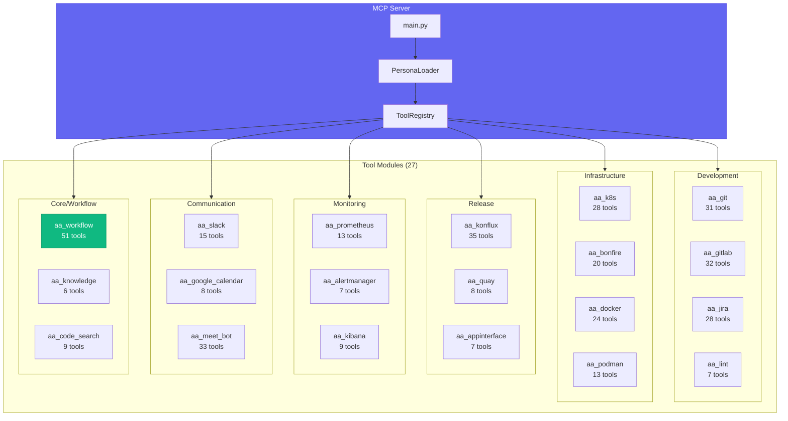
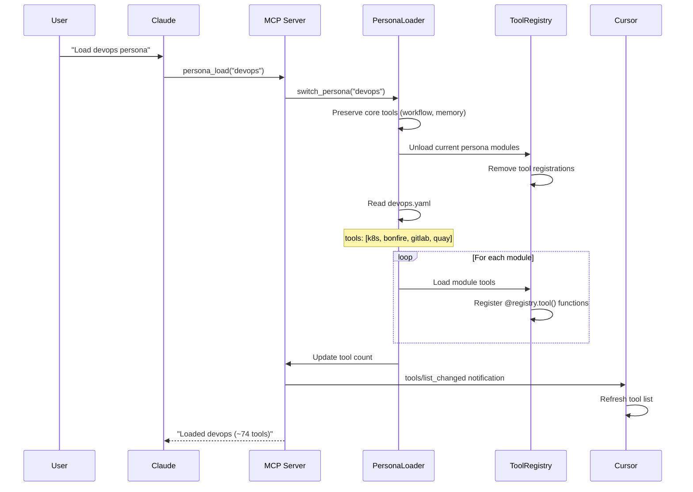
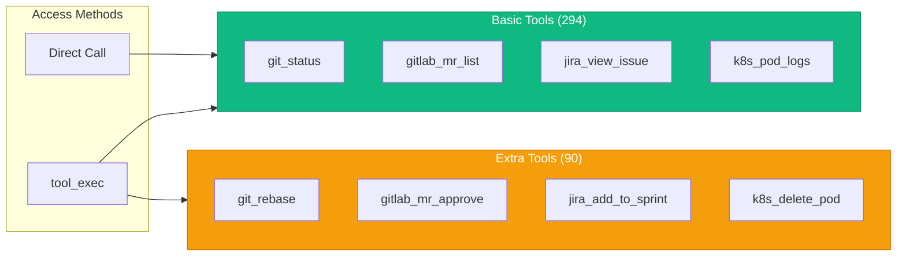

# Tool Modules Reference

Tool modules are MCP plugins that provide specific capabilities. Each module contains related tools that are loaded based on which persona is active.

> **Terminology:** "Personas" (sometimes called "agents") are tool configuration profiles that determine which modules are loaded. This is NOT a multi-agent AI system.

## Quick Reference

**435 tools** across **27 modules**, split into **294 basic** (loaded by default) and **90 extra** (on-demand) plus **51 workflow core** tools.

> **Performance:** Loading basic tools only reduces context window usage by approximately 30%. Extra tools are available via `tool_exec()`.

| Module | Basic | Extra | Total | Description |
|--------|-------|-------|-------|-------------|
| [aa_meet_bot](./meet_bot.md) | 33 | 0 | 33 | Google Meet bot control, scheduling, transcription |
| [aa_konflux](./konflux.md) | 22 | 13 | 35 | Tekton pipelines, components, snapshots, releases |
| [aa_gitlab](./gitlab.md) | 18 | 14 | 32 | MRs, pipelines, comments, reviews, issues |
| [aa_git](./git.md) | 28 | 3 | 31 | Repository operations, commits, branches, remotes |
| [aa_jira](./jira.md) | 17 | 11 | 28 | Issue management, sprints, comments, workflows |
| [aa_k8s](./k8s.md) | 22 | 6 | 28 | Pods, deployments, logs, exec, secrets |
| [aa_docker](./docker.md) | 24 | 0 | 24 | Docker/compose operations, image builds |
| [aa_bonfire](./bonfire.md) | 10 | 10 | 20 | Ephemeral namespace management |
| [aa_slack](./slack.md) | 12 | 3 | 15 | Messaging, channels, reactions |
| [aa_podman](./podman.md) | 13 | 0 | 13 | Container management via Podman |
| [aa_prometheus](./prometheus.md) | 5 | 8 | 13 | Metrics queries, alerts, rules |
| [aa_performance](./performance.md) | 13 | 0 | 13 | Performance tracking, competency evidence |
| [aa_code_search](./code_search.md) | 9 | 0 | 9 | Semantic code search, vector indexing |
| [aa_concur](./concur.md) | 9 | 0 | 9 | SAP Concur expense submission |
| [aa_dev_workflow](./dev_workflow.md) | 9 | 0 | 9 | Workflow helpers, start_work, prepare_mr |
| [aa_kibana](./kibana.md) | 1 | 8 | 9 | Log search, index patterns, dashboards |
| [aa_google_calendar](./google_calendar.md) | 8 | 0 | 8 | Calendar events, meeting management |
| [aa_quay](./quay.md) | 6 | 2 | 8 | Container registry, image verification |
| [aa_scheduler](./scheduler.md) | 7 | 0 | 7 | Cron job scheduling, background tasks |
| [aa_alertmanager](./alertmanager.md) | 4 | 3 | 7 | Alert management, silences |
| [aa_appinterface](./appinterface.md) | 4 | 3 | 7 | GitOps configuration validation |
| [aa_lint](./lint.md) | 1 | 6 | 7 | Code linting, pre-commit checks |
| [aa_ollama](./ollama.md) | 7 | 0 | 7 | Local LLM inference via Ollama |
| [aa_knowledge](./knowledge.md) | 6 | 0 | 6 | Project knowledge management |
| [aa_project](./project.md) | 5 | 0 | 5 | Project configuration management |
| [aa_make](./make.md) | 1 | 0 | 1 | Makefile target execution |
| [aa_workflow](./workflow.md) | 51 | 0 | 51 | Core: sessions, memory, skills, personas, infra |

**Grand Total:** 435 tools (294 basic + 90 extra + 51 workflow)

## Architecture



## Module Categories

### Development (98 tools)

| Module | Tools | Purpose |
|--------|-------|---------|
| [aa_git](./git.md) | 31 | Git repository operations, commits, branches |
| [aa_gitlab](./gitlab.md) | 32 | Merge requests, pipelines, comments |
| [aa_jira](./jira.md) | 28 | Issue tracking, sprints, workflows |
| [aa_lint](./lint.md) | 7 | Code linting, pre-commit checks |

### Infrastructure (85 tools)

| Module | Tools | Purpose |
|--------|-------|---------|
| [aa_k8s](./k8s.md) | 28 | Kubernetes pods, deployments, logs |
| [aa_docker](./docker.md) | 24 | Docker/compose operations |
| [aa_bonfire](./bonfire.md) | 20 | Ephemeral namespace management |
| [aa_podman](./podman.md) | 13 | Podman container management |

### Release & CI/CD (50 tools)

| Module | Tools | Purpose |
|--------|-------|---------|
| [aa_konflux](./konflux.md) | 35 | Tekton pipelines, builds, releases |
| [aa_quay](./quay.md) | 8 | Container image registry |
| [aa_appinterface](./appinterface.md) | 7 | GitOps configuration |

### Monitoring & Observability (29 tools)

| Module | Tools | Purpose |
|--------|-------|---------|
| [aa_prometheus](./prometheus.md) | 13 | Metrics queries, alerts |
| [aa_kibana](./kibana.md) | 9 | Log search, dashboards |
| [aa_alertmanager](./alertmanager.md) | 7 | Alert and silence management |

### Communication (56 tools)

| Module | Tools | Purpose |
|--------|-------|---------|
| [aa_meet_bot](./meet_bot.md) | 33 | Google Meet automation |
| [aa_slack](./slack.md) | 15 | Slack messaging |
| [aa_google_calendar](./google_calendar.md) | 8 | Calendar events |

### Core System (117 tools)

| Module | Tools | Purpose |
|--------|-------|---------|
| [aa_workflow](./workflow.md) | 51 | Sessions, memory, skills, personas |
| [aa_performance](./performance.md) | 13 | Performance tracking |
| [aa_code_search](./code_search.md) | 9 | Semantic code search |
| [aa_dev_workflow](./dev_workflow.md) | 9 | Workflow helpers |
| [aa_concur](./concur.md) | 9 | Expense submission |
| [aa_scheduler](./scheduler.md) | 7 | Background job scheduling |
| [aa_ollama](./ollama.md) | 7 | Local LLM inference |
| [aa_knowledge](./knowledge.md) | 6 | Project knowledge |
| [aa_project](./project.md) | 5 | Project configuration |
| [aa_make](./make.md) | 1 | Make targets |

## Tool Loading Flow



## Basic vs Extra Tools

Tools are split to optimize context window usage:

| Type | When Loaded | Use Case |
|------|-------------|----------|
| **Basic** | Always with persona | Common operations used in skills |
| **Extra** | On-demand via `tool_exec()` | Specialized operations |



### Accessing Extra Tools

```python
# Git rebase (in git_extra)
tool_exec("git_rebase", '{"repo": "backend", "onto": "origin/main"}')

# Jira sprint operations (in jira_extra)
tool_exec("jira_add_to_sprint", '{"issue_key": "AAP-12345"}')

# Bonfire full deploy (in bonfire_extra)
tool_exec("bonfire_deploy_aa", '{"namespace": "ephemeral-xxx"}')
```

## Infrastructure Tools

The workflow module includes essential infrastructure tools for auto-healing:

| Tool | Purpose |
|------|---------|
| `vpn_connect()` | Connect to Red Hat VPN |
| `kube_login(cluster)` | Refresh Kubernetes authentication |
| `session_start(agent)` | Initialize session with context |
| `debug_tool(tool, error)` | Analyze failing tool source |

## Environment Variables

| Variable | Module | Description |
|----------|--------|-------------|
| `JIRA_URL` | aa_jira | Jira instance URL |
| `JIRA_JPAT` | aa_jira | Jira Personal Access Token |
| `GITLAB_TOKEN` | aa_gitlab | GitLab API token |
| `KUBECONFIG` | aa_k8s | Default kubeconfig path |
| `SLACK_BOT_TOKEN` | aa_slack | Slack bot OAuth token |
| `SLACK_APP_TOKEN` | aa_slack | Slack app-level token |
| `OLLAMA_HOST` | aa_ollama | Ollama server URL |

## Adding a New Module

1. Create directory structure:
```bash
mkdir -p tool_modules/aa_{name}/src
touch tool_modules/aa_{name}/src/__init__.py
touch tool_modules/aa_{name}/src/tools_basic.py
```

2. Create `tools_basic.py`:
```python
from mcp.server.fastmcp import FastMCP
from server.tool_registry import ToolRegistry

def register_tools(server: FastMCP) -> int:
    registry = ToolRegistry(server)

    @registry.tool()
    async def my_tool(arg: str) -> str:
        """Tool description."""
        return f"Result: {arg}"

    return registry.count
```

3. Add to persona config (`personas/{name}.yaml`):
```yaml
tools:
  - {module_name}
```

4. Register in meta_tools.py:
```python
TOOL_REGISTRY = {
    # ...
    "{module_name}": ["my_tool"],
}
```

## See Also

- [Architecture Overview](../architecture/README.md) - System design
- [Personas](../personas/README.md) - Tool loading profiles
- [MCP Implementation](../architecture/mcp-implementation.md) - Server details
- [Skills Reference](../skills/README.md) - Workflows using these tools
