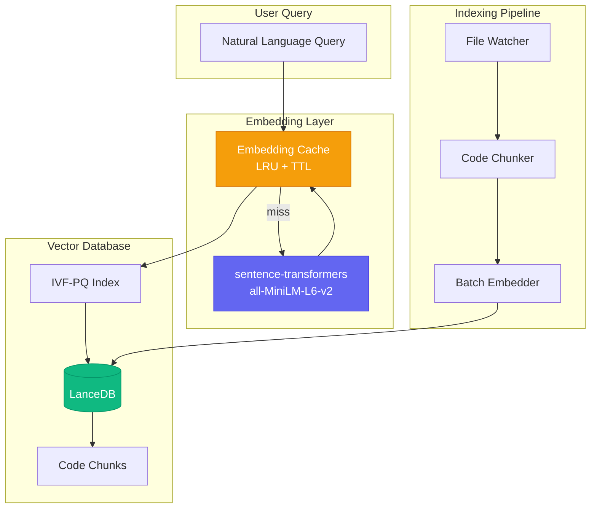
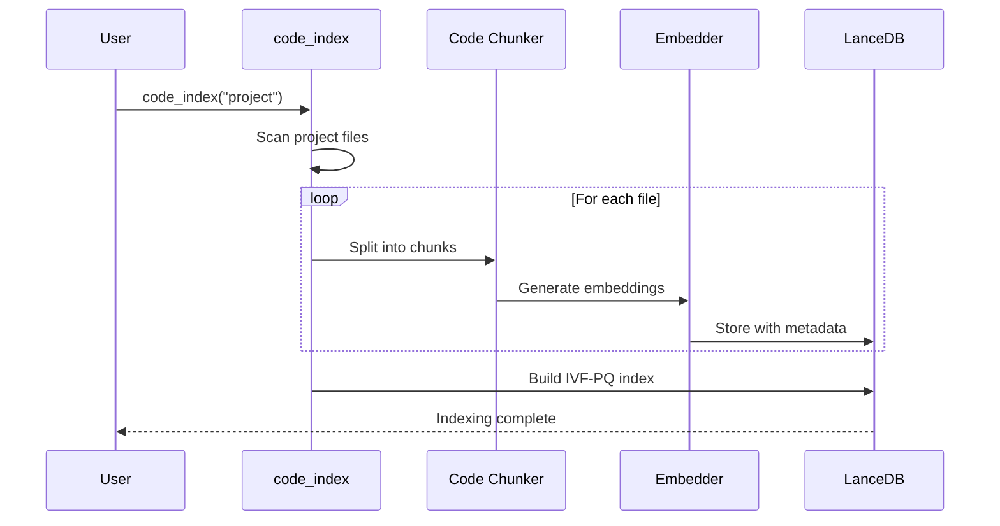
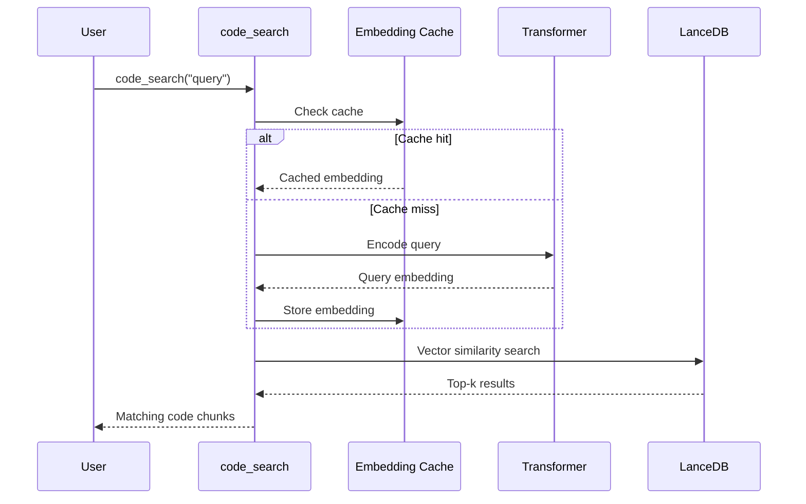
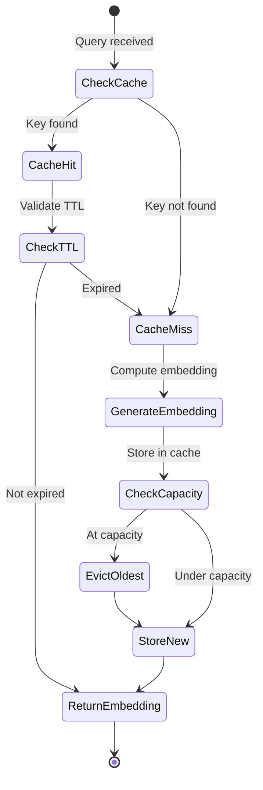
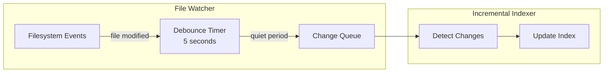
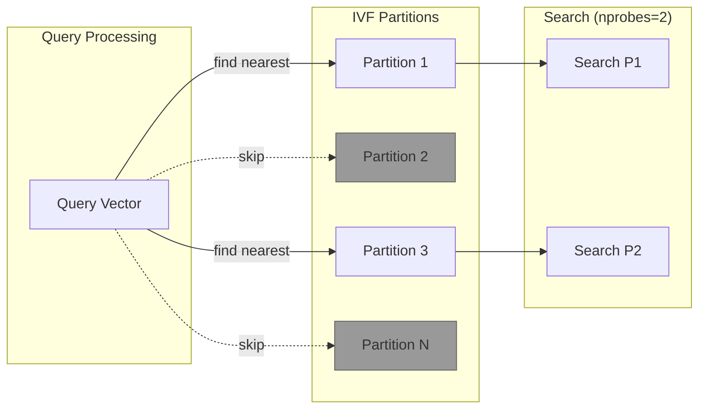

# 🔍 Code Search Module (aa_code_search)

Semantic code search using local vector embeddings. Enables natural language queries across indexed codebases.

## Overview

The code search module provides:
- **Semantic search**: Find code by meaning, not just exact text matches
- **Local vector database**: Uses LanceDB (embedded, serverless)
- **Automatic indexing**: File watcher for incremental updates
- **Performance optimization**: IVF-PQ indexing, query embedding cache

## Architecture



## Configuration

| Setting | Default | Description |
|---------|---------|-------------|
| `EMBEDDING_MODEL` | all-MiniLM-L6-v2 | Sentence transformer model |
| `VECTOR_DB_PATH` | ~/.cache/aa-workflow/vectors | Vector database location |
| `CHUNK_SIZE` | 1500 chars | Code chunk size |
| `CHUNK_OVERLAP` | 200 chars | Overlap between chunks |
| `EMBEDDING_DIM` | 384 | Embedding dimension |
| `INDEX_STALE_MINUTES` | 60 | Auto-refresh threshold |

### IVF-PQ Index Configuration

| Setting | Default | Description |
|---------|---------|-------------|
| `INDEX_TYPE` | IVF_PQ | Index type (IVF_PQ, IVF_FLAT, FLAT) |
| `NUM_PARTITIONS` | 256 | IVF partitions (clusters) |
| `NUM_SUB_VECTORS` | 96 | PQ sub-vectors for compression |
| `DEFAULT_NPROBES` | 20 | Partitions to search |

### Query Cache Configuration

| Setting | Default | Description |
|---------|---------|-------------|
| `CACHE_ENABLED` | True | Enable embedding cache |
| `CACHE_MAX_SIZE` | 1000 | Maximum cached embeddings |
| `CACHE_TTL_SECONDS` | 3600 | Cache entry expiration |

## Tools

### Basic Tools

| Tool | Description |
|------|-------------|
| `code_index` | Index a project's code into the vector database |
| `code_search` | Semantic search across indexed code |
| `code_stats` | Get indexing statistics and status |
| `code_health` | Health check and performance metrics |
| `code_cache` | Manage the query embedding cache |

### Extra Tools

| Tool | Description |
|------|-------------|
| `code_compact` | Optimize vector database files |
| `code_watch` | Start/stop automatic index updates |
| `code_watch_all` | Manage watchers for all projects |
| `knowledge_deep_scan` | Deep scan with Claude analysis |

## Tool Reference

### `code_index`

Index a project's code into the vector database.

```python
code_index(project="automation-analytics-backend")
code_index(project="automation-analytics-backend", force=True)  # Full re-index
```

**Parameters:**
- `project`: Project name from config.json (auto-detects if empty)
- `force`: If True, re-index all files. Otherwise only changed files.

### `code_search`

Semantic search across indexed code.

```python
code_search("How does billing calculate vCPU hours?", "automation-analytics-backend")
code_search("error handling", project="backend", file_filter="api/")
code_search("authentication", type_filter="function")
```

**Parameters:**
- `query`: Natural language query
- `project`: Project name (auto-detects if one project configured)
- `limit`: Maximum results (default 10)
- `file_filter`: Filter to specific file path pattern
- `type_filter`: Filter by code type: "function", "class", "module"

### `code_watch`

Start or stop automatic index updates for a project.

```python
code_watch("automation-analytics-backend", "start")
code_watch("automation-analytics-backend", "stop")
code_watch(action="status")  # Show all watchers
```

**Parameters:**
- `project`: Project name
- `action`: "start", "stop", or "status"
- `debounce_seconds`: Wait time before re-indexing (default 5s)

## Data Flow

### Indexing Flow



### Search Flow



## Embedding Cache

The embedding cache uses a thread-safe LRU (Least Recently Used) strategy with TTL (Time To Live):



**Cache Statistics:**
- `size`: Current number of cached embeddings
- `max_size`: Maximum capacity
- `hits`: Cache hit count
- `misses`: Cache miss count
- `hit_rate`: Hit rate percentage

## File Watcher

The file watcher monitors project directories for changes:



**Benefits:**
- Automatic index updates on file changes
- Debouncing prevents excessive re-indexing
- Incremental updates (only changed files)

## Performance Optimization

### IVF-PQ Index

The IVF-PQ (Inverted File with Product Quantization) index provides:

1. **Fast search**: Only searches relevant partitions
2. **Memory efficient**: Compressed vector storage
3. **Tunable accuracy**: Adjust nprobes for speed/accuracy tradeoff



### Disk Optimization

Vector databases grow with fragment files. Use `code_compact` to optimize:

```python
code_compact("redhat-ai-workflow")  # Optimize single project
code_compact()  # Optimize all projects
```

## Example Queries

### Finding Code by Concept

```python
# Find billing calculation logic
code_search("How does billing calculate vCPU hours?")

# Find authentication implementation
code_search("Where is user authentication handled?")

# Find API input validation
code_search("What validates API input?")
```

### Filtering by Location

```python
# Search only in API directory
code_search("error handling", file_filter="api/")

# Search only in tests
code_search("mock database", file_filter="tests/")
```

### Filtering by Type

```python
# Find only functions
code_search("calculate total", type_filter="function")

# Find only classes
code_search("user management", type_filter="class")
```

## Dependencies

- **lancedb**: Embedded vector database
- **sentence-transformers**: Local embedding models
- **watchdog**: Filesystem monitoring (for watcher)
- **Optional**: OpenVINO for NPU/iGPU acceleration

## See Also

- [Vector Search Architecture](../architecture/vector-search.md)
- [Knowledge System](../architecture/knowledge-system.md)
- [Workflow Module](./workflow.md)
