# Concur Tools (aa_concur)

SAP Concur expense submission automation with AI assistance.

## Overview

The Concur module automates the submission of Remote Worker Expenses to SAP Concur. It integrates with GOMO (internet bill provider) and uses Playwright for browser automation with semantic element descriptions.

## Tools (9 total)

| Tool | Description |
|------|-------------|
| `concur_submit_expense` | Main workflow - submit a complete expense |
| `concur_login` | Authenticate to Concur via Red Hat SSO |
| `concur_create_report` | Create a new expense report |
| `concur_add_expense` | Add an expense line item |
| `concur_attach_receipt` | Attach receipt to expense |
| `concur_submit_report` | Submit report for approval |
| `concur_status` | Check expense report status |
| `gomo_download_bill` | Download bill from GOMO |
| `gomo_login` | Authenticate to GOMO |

## Architecture

```mermaid
sequenceDiagram
    participant User
    participant Claude
    participant Concur as Concur Tools
    participant GOMO
    participant Bitwarden
    participant Browser as Playwright
    participant SAP as SAP Concur

    User->>Claude: /submit-expense
    Claude->>Concur: concur_submit_expense()

    Concur->>Bitwarden: Get GOMO credentials
    Bitwarden-->>Concur: Credentials

    Concur->>Browser: Launch browser
    Browser->>GOMO: Navigate & login
    GOMO-->>Browser: Bill PDF
    Browser-->>Concur: Downloaded bill

    Concur->>Browser: Navigate to Concur SSO
    Browser->>SAP: Red Hat SSO login
    SAP-->>Browser: Authenticated

    Concur->>Browser: Create expense report
    Browser->>SAP: POST report
    SAP-->>Browser: Report ID

    Concur->>Browser: Add expense + attach receipt
    Browser->>SAP: Upload receipt

    Concur->>Browser: Submit for approval
    SAP-->>Browser: Submitted

    Browser-->>Concur: Success
    Concur-->>Claude: Expense submitted
    Claude-->>User: ✅ Expense report submitted
```



## Configuration

Configure in `config.json`:

```json
{
  "concur": {
    "gomo": {
      "url": "https://my.gomo.ie/",
      "bills_url": "https://my.gomo.ie/bills",
      "bitwarden_item": "gomo.ie"
    },
    "concur": {
      "sso_url": "https://auth.redhat.com/auth/realms/EmployeeIDP/protocol/saml/clients/concursolutions",
      "home_url": "https://us2.concursolutions.com/home",
      "expense_type": "Remote Worker Expense",
      "payment_type": "Cash",
      "max_usd_amount": 40.00
    },
    "downloads_dir": "~/src/aa-concur/downloads"
  }
}
```

## Prerequisites

1. **Bitwarden CLI** - For credential storage
   ```bash
   export BW_SESSION=$(bw unlock --raw)
   ```

2. **GOMO Account** - Store credentials in Bitwarden as "gomo.ie"

3. **Red Hat SSO** - For Concur authentication

4. **Playwright** - Browser automation
   ```bash
   uv add playwright
   playwright install chromium
   ```

## Common Usage

### Submit Monthly Expense

```python
# Full automated workflow
concur_submit_expense(
    month="2026-01",
    description="Remote Worker Expense - January 2026"
)
```

### Step-by-Step Workflow

```python
# 1. Download bill from GOMO
gomo_download_bill(month="2026-01")

# 2. Login to Concur
concur_login()

# 3. Create report
report_id = concur_create_report(
    name="Remote Worker Expense - January 2026"
)

# 4. Add expense with receipt
concur_add_expense(
    report_id=report_id,
    amount=20.00,
    currency="EUR",
    receipt_path="~/src/aa-concur/downloads/gomo_2026-01.pdf"
)

# 5. Submit for approval
concur_submit_report(report_id=report_id)
```

### Check Status

```python
concur_status()
# Returns list of pending/approved/rejected reports
```

## Skill Integration

The `/submit-expense` command uses the `submit_expense` skill:

```yaml
# skills/submit_expense.yaml
name: submit_expense
description: Submit Remote Worker Expense to SAP Concur

steps:
  - name: download_bill
    tool: gomo_download_bill
    args:
      month: "{{ inputs.month | default(current_month) }}"

  - name: submit
    tool: concur_submit_expense
    args:
      month: "{{ inputs.month }}"
      description: "Remote Worker Expense - {{ inputs.month }}"
```

## Error Handling

The module uses adaptive retry logic with semantic element descriptions:

```mermaid
stateDiagram-v2
    [*] --> FindElement
    FindElement --> Click: Element Found
    FindElement --> RetryWithAlt: Not Found
    RetryWithAlt --> FindElement: Try Alternative Selector
    RetryWithAlt --> AIAssist: All Selectors Failed
    AIAssist --> FindElement: AI Suggests New Selector
    AIAssist --> Fail: Cannot Recover
    Click --> [*]: Success
    Fail --> [*]: Error
```

Common errors and recovery:
- **SSO timeout** - Re-authenticate automatically
- **Element not found** - Try alternative selectors
- **Upload failed** - Retry with exponential backoff

## Security

- Credentials stored in Bitwarden (not in config)
- SSO authentication (no password storage)
- Browser session isolated per execution
- Downloads directory cleaned after submission

## See Also

- [Submit Expense Skill](../skills/submit_expense.md)
- [GOMO Integration](https://my.gomo.ie)
- [SAP Concur](https://www.concur.com/)
