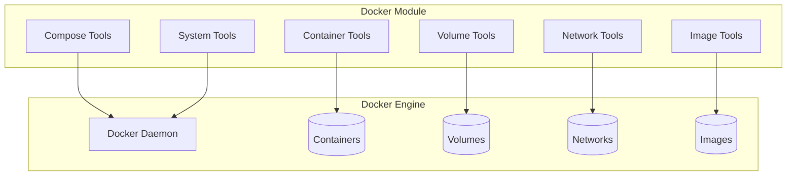

# Docker Tools (aa_docker)

Container and Docker Compose management tools for local development and testing.

## Overview

The Docker module provides comprehensive container management including Docker Compose workflows, individual container operations, volume management, network configuration, and image handling.

## Tools (24 total)

### Docker Compose Tools

| Tool | Description |
|------|-------------|
| `docker_compose_status` | Check container status in a compose project |
| `docker_compose_up` | Start docker-compose services |
| `docker_compose_down` | Stop and remove docker-compose services |
| `docker_compose_logs` | View logs from docker-compose services |
| `docker_compose_restart` | Restart docker-compose services |

### Container Tools

| Tool | Description |
|------|-------------|
| `docker_ps` | List running containers |
| `docker_logs` | View container logs |
| `docker_exec` | Execute commands in containers |
| `docker_cp` | Copy files to/from containers |
| `docker_start` | Start a stopped container |
| `docker_stop` | Stop a running container |
| `docker_restart` | Restart a container |
| `docker_rm` | Remove a container |
| `docker_inspect` | Inspect a Docker object |

### Volume Tools

| Tool | Description |
|------|-------------|
| `docker_volume_list` | List volumes |
| `docker_volume_rm` | Remove a volume |
| `docker_volume_prune` | Remove unused volumes |

### Network Tools

| Tool | Description |
|------|-------------|
| `docker_network_list` | List networks |
| `docker_network_inspect` | Inspect a network |
| `docker_network_create` | Create a network |
| `docker_network_rm` | Remove a network |

### Image Tools

| Tool | Description |
|------|-------------|
| `docker_images` | List images |
| `docker_image_rm` | Remove an image |

### System Tools

| Tool | Description |
|------|-------------|
| `docker_system_prune` | Remove unused Docker data |

## Architecture



## Common Usage

### Start Local Development Environment

```python
# Start all services
docker_compose_up(repo="backend", detach=True)

# Check status
docker_compose_status(repo="backend")

# View logs
docker_compose_logs(repo="backend", service="api", tail=100)
```

### Debug Container Issues

```python
# List containers
docker_ps()

# Execute command in container
docker_exec(container="backend_api_1", command="python manage.py shell")

# View logs
docker_logs(container="backend_api_1", tail=200)
```

### Cleanup

```python
# Stop and remove containers
docker_compose_down(repo="backend", volumes=True)

# Prune unused resources
docker_system_prune(all=True)
```

## Integration with Skills

Docker tools are used by these skills:

| Skill | Docker Tools Used |
|-------|-------------------|
| `run_local_tests` | compose_up, compose_down, logs |
| `debug_prod` | logs, exec for comparison |

## Error Handling

All Docker tools include `@auto_heal` decorator for automatic recovery from:
- Docker daemon not running
- Network connectivity issues
- Resource exhaustion

## See Also

- [Podman Tools](./podman.md) - Alternative container runtime
- [Kubernetes Tools](./k8s.md) - Production container orchestration
- [Run Local Tests Skill](../skills/run_local_tests.md)
