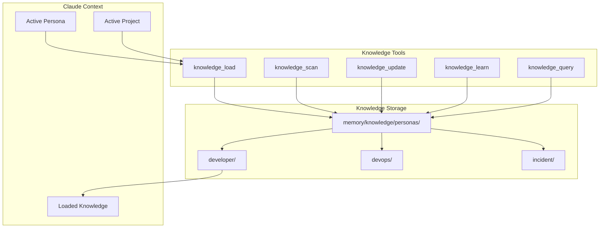
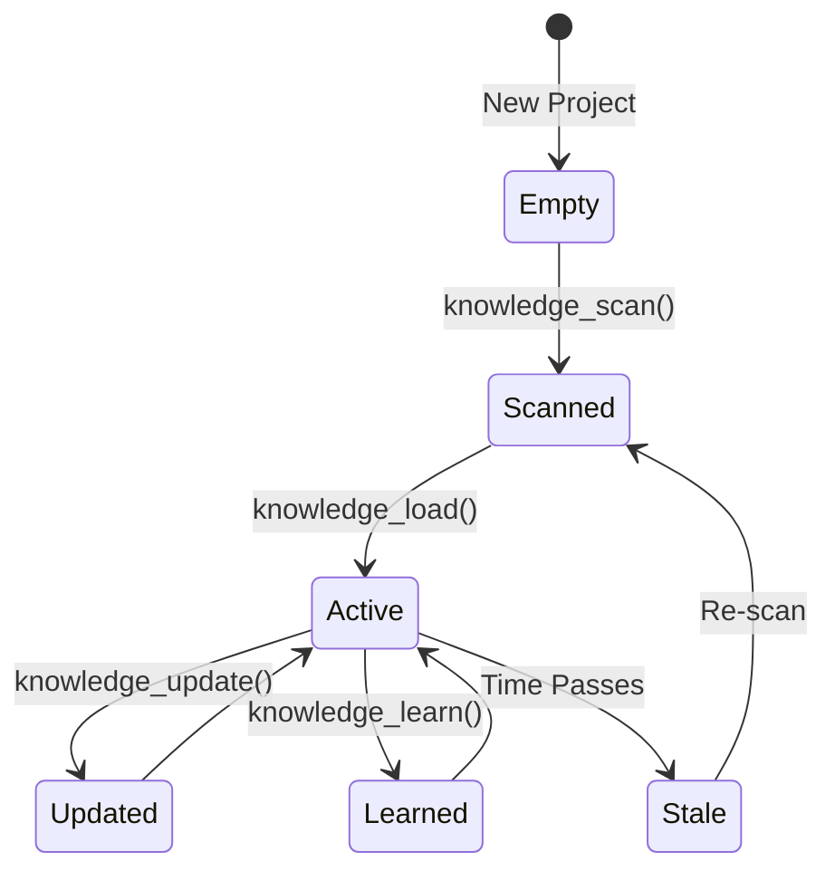
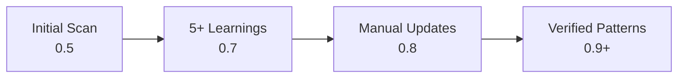

# Knowledge Tools (aa_knowledge)

Project-specific expertise loading and learning system.

## Overview

The Knowledge module enables Claude to learn and retain project-specific expertise. Knowledge is organized by persona and project, allowing Claude to provide contextual advice based on accumulated learnings.

## Tools (6 total)

| Tool | Description |
|------|-------------|
| `knowledge_load` | Load project knowledge for a persona into context |
| `knowledge_scan` | AI scans project, generates initial knowledge |
| `knowledge_update` | Update specific section of knowledge |
| `knowledge_query` | Query specific knowledge sections |
| `knowledge_learn` | Record a learning from a completed task |
| `knowledge_list` | List all available knowledge files |

## Architecture



## Knowledge Schema

Each knowledge file follows this structure:

```yaml
metadata:
  project: "automation-analytics-backend"
  persona: "developer"
  last_updated: "2026-01-26T10:00:00"
  last_scanned: "2026-01-20T08:00:00"
  confidence: 0.85

architecture:
  overview: "Flask-based REST API with Celery workers"
  key_modules:
    - name: "api"
      purpose: "REST endpoints"
      path: "src/api/"
    - name: "billing"
      purpose: "vCPU hour calculations"
      path: "src/billing/"
  data_flow: "API → Celery → PostgreSQL → S3"
  dependencies:
    - flask
    - celery
    - sqlalchemy

patterns:
  coding:
    - "Use Depends() for database sessions"
    - "Prefer dataclasses over dicts for DTOs"
  testing:
    - "Use pytest fixtures for DB setup"
    - "Mock external APIs with responses library"
  deployment:
    - "Blue-green deployments via app-interface"

gotchas:
  - "billing_processor.py requires Redis connection"
  - "Integration tests need docker-compose up first"
  - "PR titles must match 'AAP-XXXXX - type: description'"

learned_from_tasks:
  - task: "AAP-61234"
    learning: "Use timezone-aware datetimes for billing"
    date: "2026-01-15"
  - task: "AAP-61456"
    learning: "Celery tasks need explicit serializer config"
    date: "2026-01-20"
```

## Directory Structure

```
memory/knowledge/personas/
├── developer/
│   ├── automation-analytics-backend.yaml
│   ├── automation-analytics-ui.yaml
│   └── redhat-ai-workflow.yaml
├── devops/
│   ├── automation-analytics-backend.yaml
│   └── app-interface.yaml
├── incident/
│   └── automation-analytics-backend.yaml
└── workspace/
    └── redhat-ai-workflow.yaml
```

## Common Usage

### Load Knowledge at Session Start

```python
# Automatically loads based on current project and persona
knowledge_load(project="automation-analytics-backend", persona="developer")

# Returns formatted knowledge for context injection
```

### Scan a New Project

```python
# AI analyzes project structure and generates initial knowledge
knowledge_scan(project="my-new-project", persona="developer")

# Detects:
# - Language and framework
# - Directory structure
# - Config files (pyproject.toml, package.json, etc.)
# - Test patterns
# - README content
```

### Record a Learning

```python
# After completing a task, record what you learned
knowledge_learn(
    learning="Use timezone-aware datetimes for billing calculations",
    task="AAP-61234",
    project="automation-analytics-backend",
    persona="developer"
)
```

### Update Specific Section

```python
# Add a new gotcha
knowledge_update(
    project="automation-analytics-backend",
    persona="developer",
    section="gotchas",
    content="Integration tests require VPN connection",
    append=True
)
```

### Query Knowledge

```python
# Get specific section without loading full context
knowledge_query(
    project="automation-analytics-backend",
    persona="developer",
    section="patterns.testing"
)
```

## Knowledge Lifecycle



## Confidence Scoring

Knowledge confidence increases with:
- Number of learnings recorded
- Recency of scans
- Manual updates and corrections



When confidence reaches milestones, notifications are sent.

## Integration with Skills

Knowledge is automatically loaded by `session_start()` and used by skills:

| Skill | Knowledge Usage |
|-------|-----------------|
| `start_work` | Load patterns for code style |
| `create_mr` | Check gotchas before PR |
| `debug_prod` | Load incident patterns |
| `bootstrap_knowledge` | Generate all persona knowledge |

## Related Skills

- `/knowledge-scan` - Scan project and generate knowledge
- `/knowledge-load` - Load knowledge into context
- `/knowledge-update` - Update knowledge sections
- `/knowledge-learn` - Record learnings
- `/bootstrap-knowledge` - Generate comprehensive knowledge
- `/learn-architecture` - Deep architecture scan

## See Also

- [Memory System](../architecture/memory-and-auto-remediation.md)
- [Personas Reference](../personas/README.md)
- [Session Management](../architecture/session-management.md)
