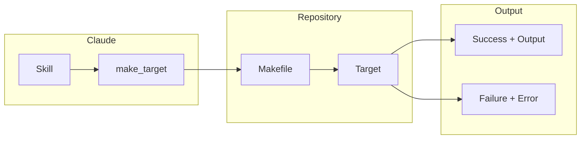
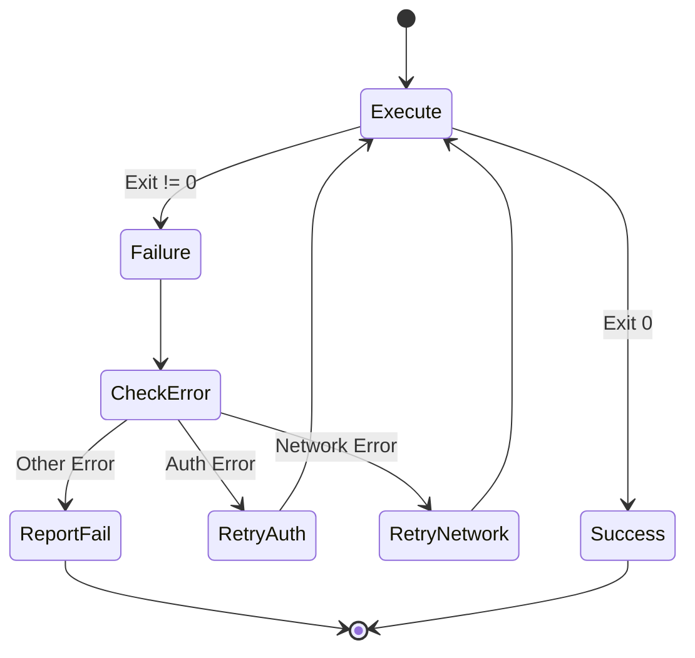

# Make Tools (aa_make)

Makefile target execution for repository automation.

## Overview

The Make module provides a simple wrapper around `make` commands, enabling execution of Makefile targets with proper error handling and timeout support.

## Tools (1 total)

| Tool | Description |
|------|-------------|
| `make_target` | Run a make target in a repository |

## Architecture



## Common Usage

### Run Tests

```python
make_target(repo="backend", target="test")

# Output:
# ✅ make test completed
#
# ======= test session starts =======
# ...
```

### Run Migrations

```python
make_target(repo="backend", target="migrations")
```

### Build Project

```python
make_target(repo="backend", target="build", timeout=300)
```

### Run Multiple Targets

```python
# Run in sequence
make_target(repo="backend", target="clean")
make_target(repo="backend", target="build")
make_target(repo="backend", target="test")
```

## Parameters

| Parameter | Type | Default | Description |
|-----------|------|---------|-------------|
| `repo` | str | required | Repository path or name from config |
| `target` | str | required | Make target to run |
| `timeout` | int | 120 | Timeout in seconds |

## Common Targets

| Target | Typical Purpose |
|--------|-----------------|
| `test` | Run test suite |
| `lint` | Run linters |
| `build` | Build project |
| `clean` | Clean build artifacts |
| `migrations` | Run database migrations |
| `data` | Load seed data |
| `docs` | Generate documentation |
| `docker-up` | Start containers |
| `docker-down` | Stop containers |

## Error Handling

The tool includes `@auto_heal` decorator for automatic recovery:



## Output Handling

- Output is truncated to 2000 characters (tail mode)
- Success indicated by ✅ prefix
- Failure indicated by ❌ prefix with error output

## Integration with Skills

| Skill | Make Targets Used |
|-------|-------------------|
| `run_local_tests` | test |
| `create_mr` | lint (pre-commit) |
| `start_work` | migrations, data |

## Repository Resolution

The `repo` parameter is resolved using `resolve_repo_path()`:

1. If absolute path, use directly
2. If relative path, resolve from current directory
3. If project name, lookup in `config.json` repositories

## Example Makefile

```makefile
# Makefile for backend project
.PHONY: test lint build clean migrations

test:
    pytest -xvs tests/

lint:
    ruff check .
    black --check .

build:
    docker build -t backend .

clean:
    rm -rf .pytest_cache __pycache__ .ruff_cache

migrations:
    flask db upgrade

data:
    flask seed-data
```

## See Also

- [Run Local Tests Skill](../skills/run_local_tests.md)
- [Docker Tools](./docker.md) - For container operations
- [Lint Tools](./lint.md) - For code quality
