# 🤖 Meet Bot Module (aa_meet_bot)

Automated Google Meet participation with browser control, virtual devices, AI avatar video, and real-time transcription.

## Overview

The Meet Bot module provides:
- **Automatic meeting join**: Monitors calendar and joins meetings
- **Virtual camera/microphone**: Loopback devices for video/audio
- **AI avatar video**: TTS speech with lip-sync video
- **Live transcription**: Captures meeting transcript
- **Multi-meeting support**: Concurrent browser instances

## Architecture

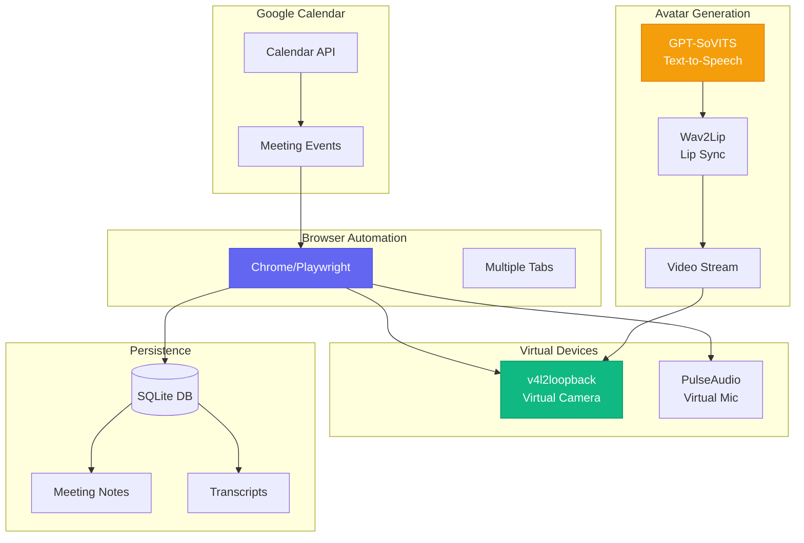

## Components

### Browser Controller

Controls Chrome via Playwright for meeting automation:

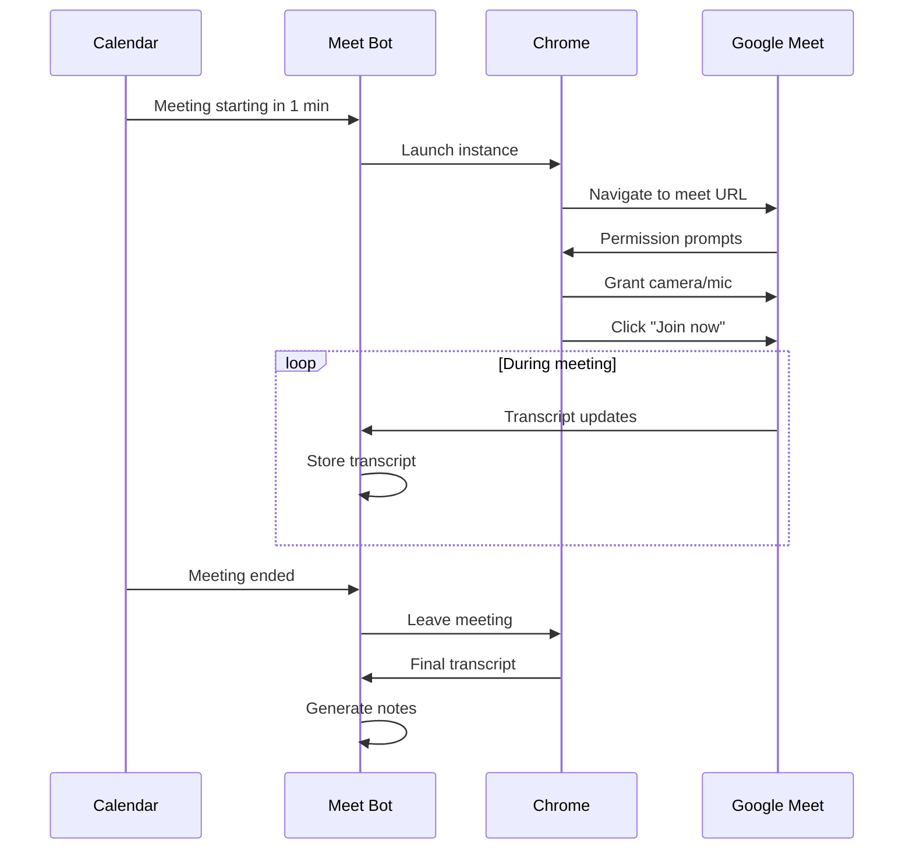

### Virtual Devices

Creates loopback devices for video and audio:

```mermaid
graph LR
    subgraph System["System Devices"]
        V4L_MOD[v4l2loopback<br/>Kernel Module]
        PULSE_SRV[PulseAudio<br/>Server]
    end

    subgraph Virtual["Virtual Devices"]
        VCAM[/dev/video10<br/>Virtual Camera]
        VMIC[Virtual Sink<br/>Monitor Source]
    end

    subgraph Bot["Meet Bot"]
        FFMPEG[FFmpeg<br/>Video Feed]
        AUDIO[Audio Stream]
    end

    V4L_MOD --> VCAM
    PULSE_SRV --> VMIC
    FFMPEG --> VCAM
    AUDIO --> VMIC
```

### Avatar Video Pipeline

Generates AI avatar video with lip-synced speech:

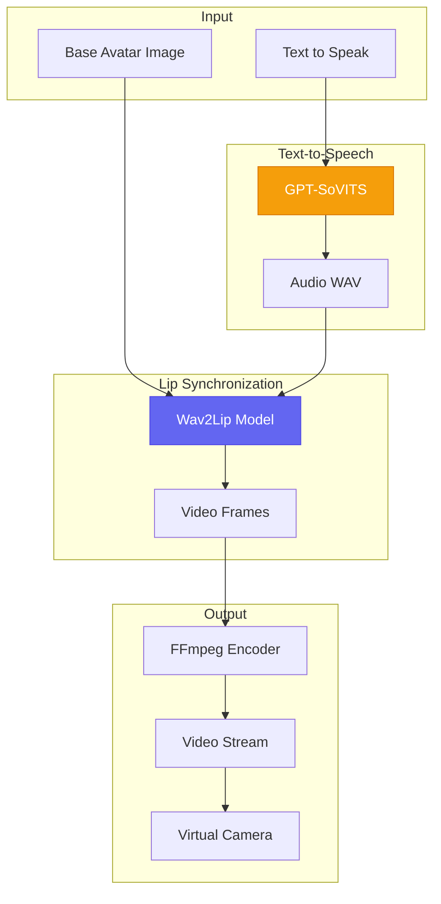

## Tools

### Calendar & Scheduling

| Tool | Description |
|------|-------------|
| `meet_list_upcoming` | List upcoming meetings from calendar |
| `meet_check_conflicts` | Check for scheduling conflicts |
| `meet_schedule` | Schedule a new meeting |
| `meet_reschedule` | Reschedule an existing meeting |

### Meeting Control

| Tool | Description |
|------|-------------|
| `meet_join` | Join a meeting by URL or ID |
| `meet_leave` | Leave current meeting |
| `meet_status` | Get current meeting status |
| `meet_list_active` | List all active meeting sessions |

### Transcript & Notes

| Tool | Description |
|------|-------------|
| `meet_get_transcript` | Get live or saved transcript |
| `meet_get_notes` | Get AI-generated meeting notes |
| `meet_summarize` | Generate meeting summary |
| `meet_search_transcripts` | Search across all transcripts |

### Avatar & Video

| Tool | Description |
|------|-------------|
| `meet_speak` | Speak text using TTS avatar |
| `meet_set_avatar` | Change avatar image |
| `meet_toggle_video` | Toggle virtual camera on/off |
| `meet_toggle_audio` | Toggle virtual mic on/off |

### Device Management

| Tool | Description |
|------|-------------|
| `meet_setup_devices` | Initialize virtual devices |
| `meet_cleanup_devices` | Remove virtual devices |
| `meet_check_devices` | Verify device status |

## State Management

### Meeting States

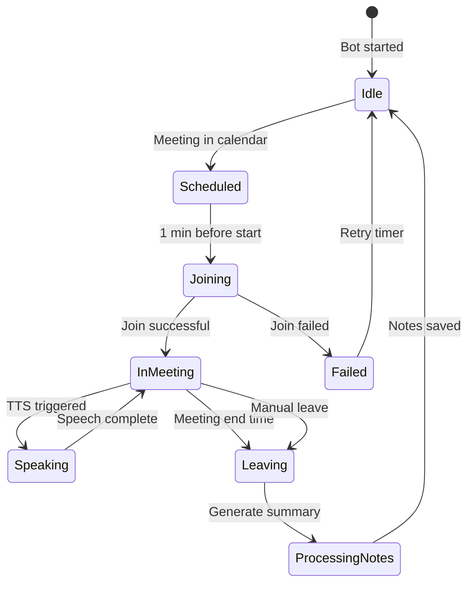

### Database Schema

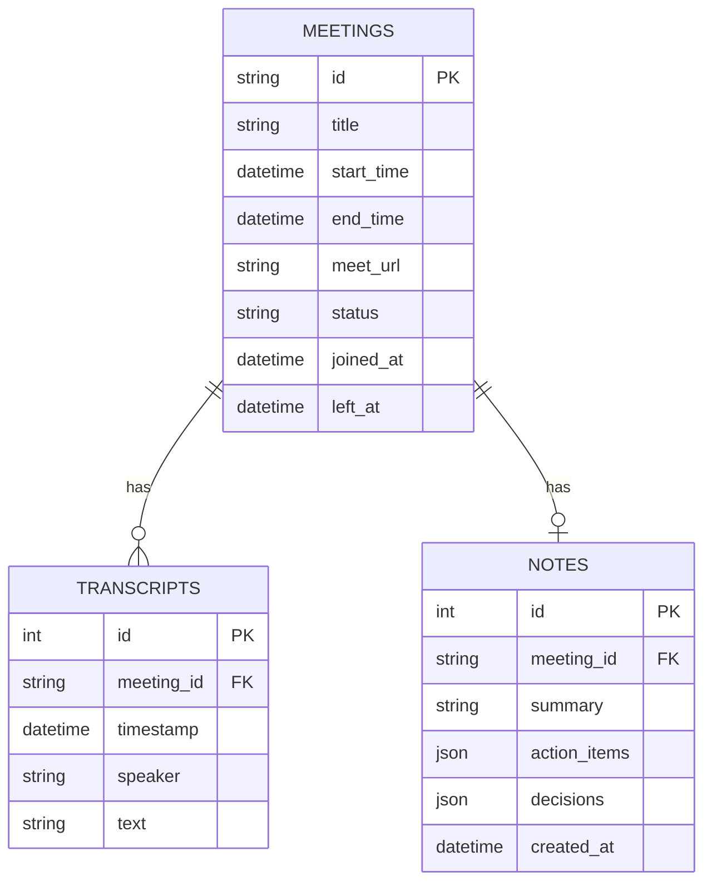

## Configuration

### config.json Settings

```json
{
  "meet_bot": {
    "calendar_id": "primary",
    "join_before_minutes": 1,
    "auto_join": true,
    "auto_leave": true,
    "auto_notes": true,
    "avatar_image": "~/.config/aa-workflow/avatar.png",
    "tts_model": "gpt-sovits",
    "browser_profile": "~/.config/aa-workflow/chrome-profile"
  }
}
```

### Virtual Device Setup

```bash
# Load v4l2loopback kernel module
sudo modprobe v4l2loopback devices=1 video_nr=10 \
    card_label="Meet Bot Camera" exclusive_caps=1

# Create PulseAudio virtual sink
pactl load-module module-null-sink sink_name=meet_bot_sink \
    sink_properties=device.description="Meet Bot Audio"
```

## Multi-Meeting Support

The bot can participate in multiple meetings concurrently:

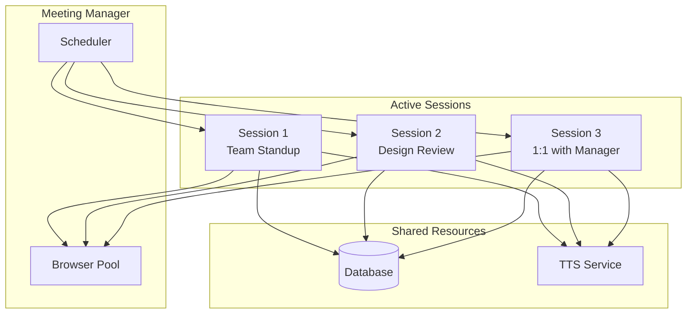

## TTS Pipeline

### GPT-SoVITS Integration

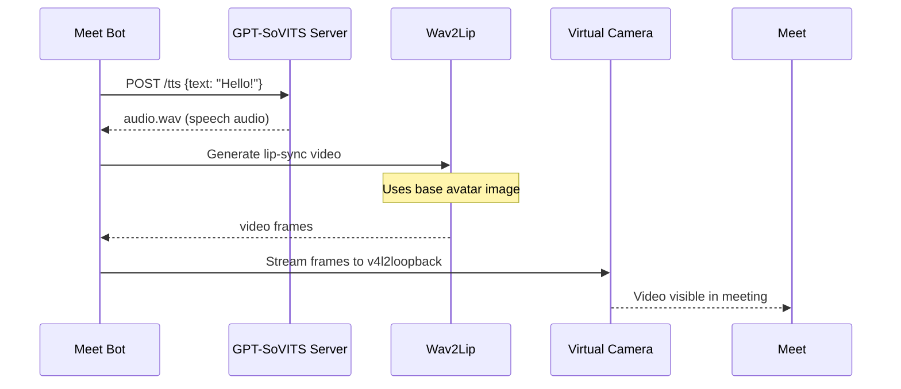

### Audio Processing

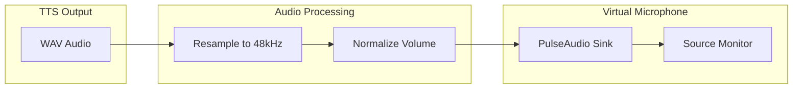

## Error Handling

### Meeting Join Failures

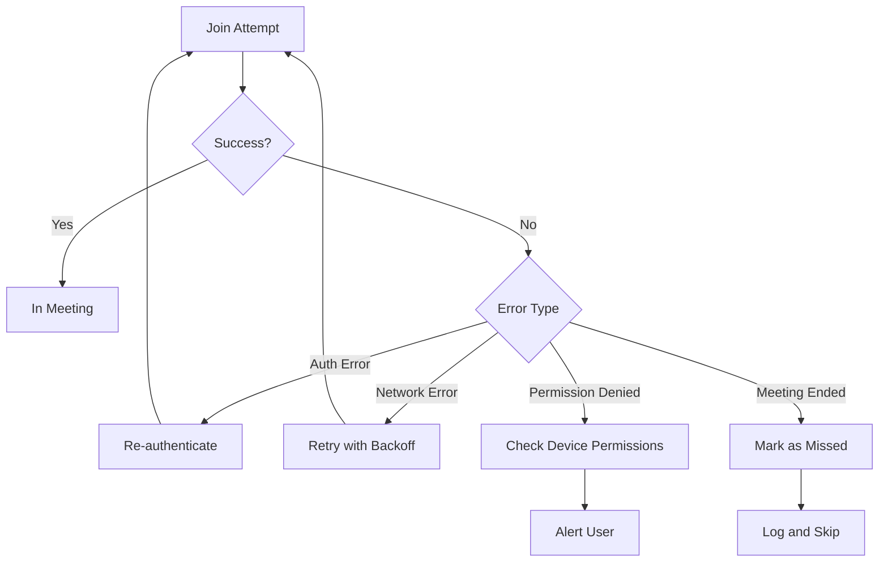

### Device Recovery

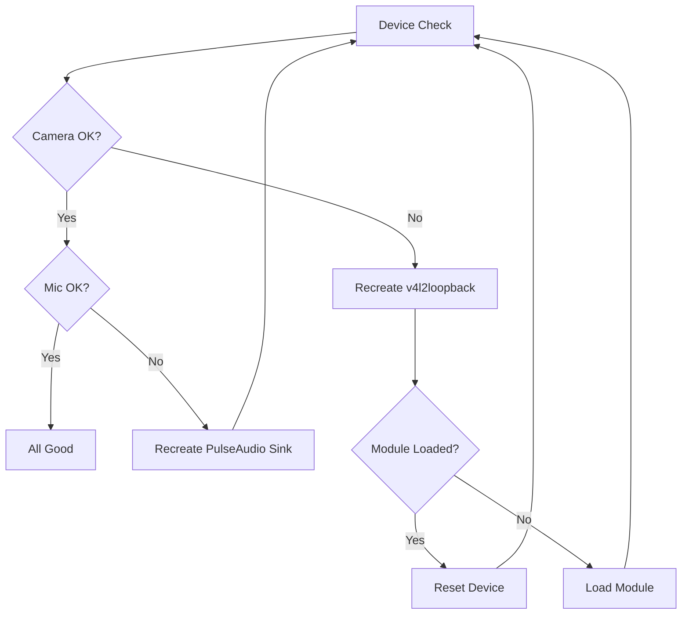

## Dependencies

### System Requirements

- **Chrome/Chromium**: For Playwright browser automation
- **v4l2loopback**: Kernel module for virtual camera
- **PulseAudio**: Audio server with null-sink support
- **FFmpeg**: Video/audio encoding and streaming

### Python Packages

- **playwright**: Browser automation
- **google-api-python-client**: Calendar API access
- **SQLite3**: Meeting data persistence
- **torch**: For Wav2Lip model (optional)

### Optional Services

- **GPT-SoVITS**: Text-to-speech server
- **Wav2Lip**: Lip synchronization model

## Daemon Integration

The Meet Bot runs as a systemd daemon:

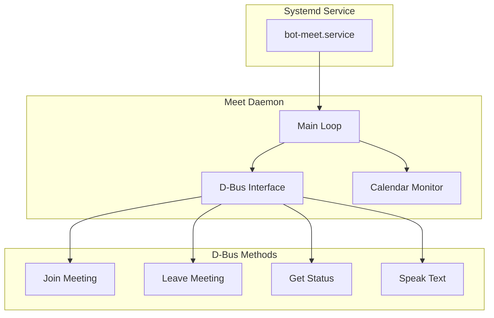

## See Also

- [Daemons Architecture](../architecture/daemons.md)
- [Meet Daemon](../daemons/meet.md)
- [Google Calendar Module](./google_calendar.md)
- [Video Daemon](../daemons/video.md)
