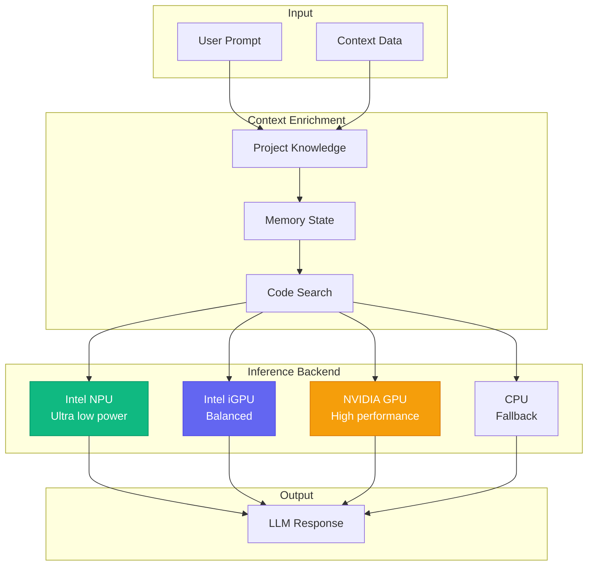
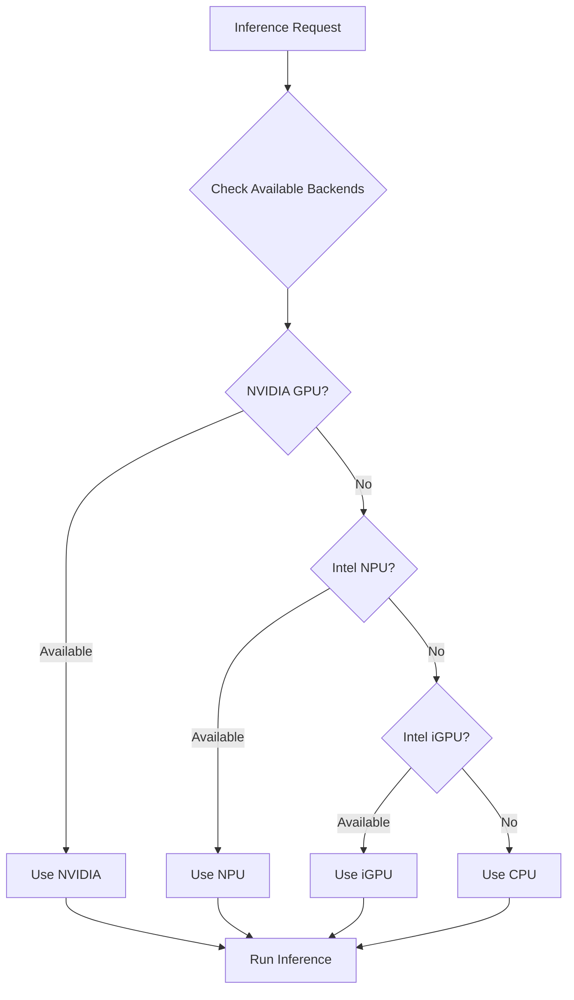
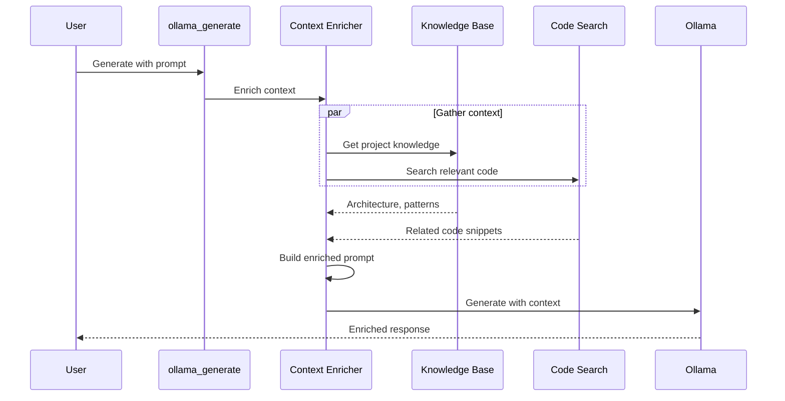
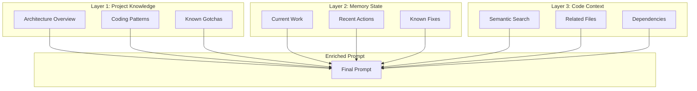
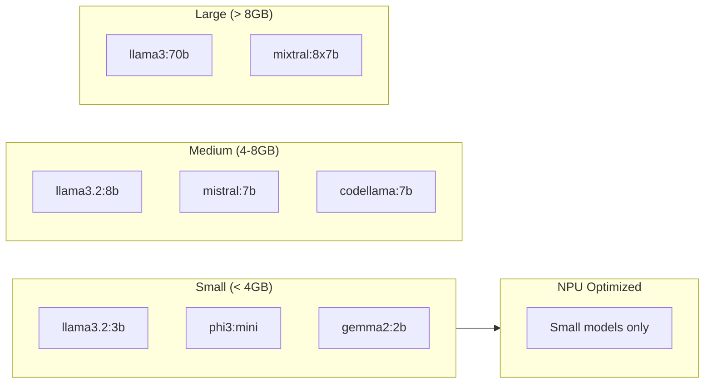
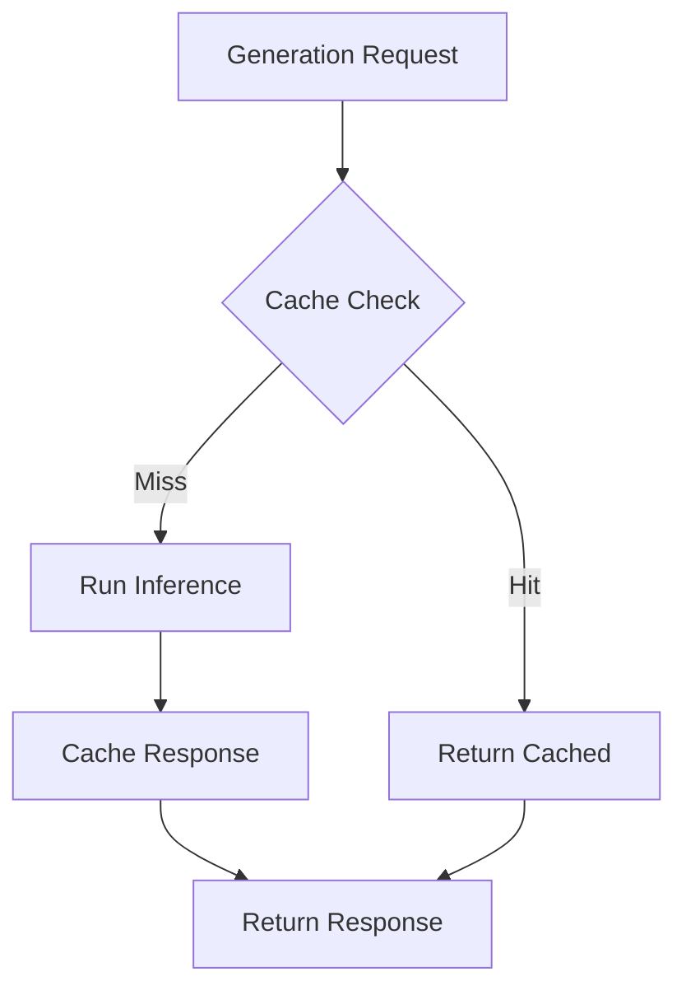
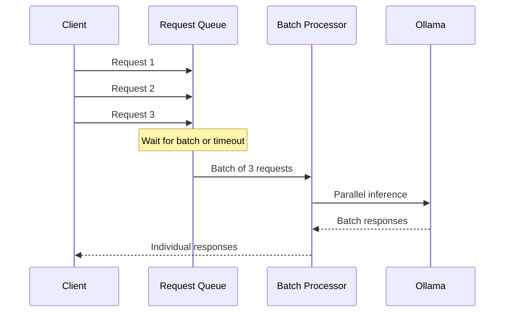
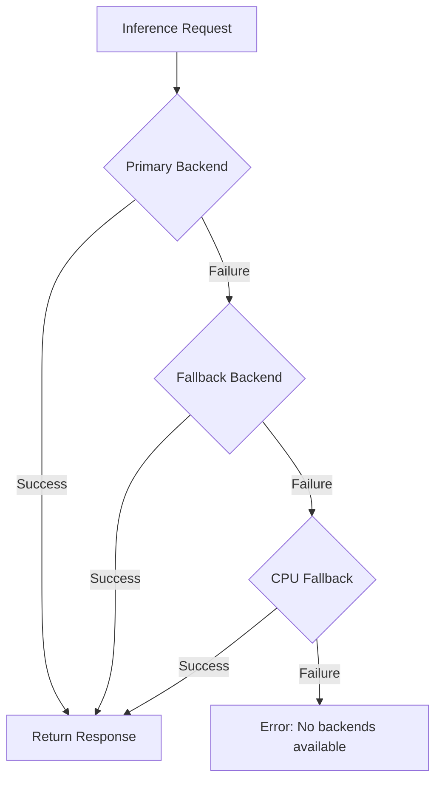

# 🧠 Ollama Module (aa_ollama)

Local LLM inference using Ollama with support for NPU, iGPU, NVIDIA, and CPU backends.

## Overview

The Ollama module provides:
- **Local inference**: Run LLMs without cloud dependencies
- **Multiple backends**: NPU, iGPU, NVIDIA GPU, or CPU
- **Context enrichment**: Enhance prompts with local knowledge
- **Embedding generation**: Local embeddings for vector search

## Architecture



## Backend Selection



### Backend Comparison

| Backend | Speed | Power | Memory | Best For |
|---------|-------|-------|--------|----------|
| **NVIDIA GPU** | Fastest | High | 8GB+ VRAM | Large models, batch processing |
| **Intel NPU** | Fast | Ultra Low | Shared | Always-on, small models |
| **Intel iGPU** | Medium | Low | Shared | Balanced workloads |
| **CPU** | Slowest | Medium | RAM | Fallback, any model |

## Tools

### Inference

| Tool | Description |
|------|-------------|
| `ollama_generate` | Generate text completion |
| `ollama_chat` | Chat-style conversation |
| `ollama_embed` | Generate embeddings |

### Backend Management

| Tool | Description |
|------|-------------|
| `ollama_list_models` | List available models |
| `ollama_pull_model` | Download a model |
| `ollama_backend_status` | Check backend availability |

### Context Enrichment

| Tool | Description |
|------|-------------|
| `ollama_enrich_context` | Enrich prompt with context |
| `ollama_classify` | Classify text using local model |

## Context Enrichment

The context enrichment pipeline adds relevant information to prompts:



### Enrichment Layers



## Configuration

### config.json Settings

```json
{
  "ollama": {
    "base_url": "http://localhost:11434",
    "default_model": "llama3.2:8b",
    "backend_priority": ["nvidia", "npu", "igpu", "cpu"],
    "context_enrichment": {
      "enabled": true,
      "include_knowledge": true,
      "include_code_search": true,
      "max_context_tokens": 4096
    }
  }
}
```

### NPU Configuration

For Intel NPU acceleration (Meteor Lake and newer):

```bash
# Check NPU availability
$ cat /sys/class/accel/accel0/device/description
Intel(R) AI Boost

# Set environment for NPU
export OLLAMA_NPU_ENABLED=1
export OLLAMA_NPU_DEVICE=/dev/accel/accel0
```

## Model Management

### Available Models



### Model Selection by Task

| Task | Recommended Model | Backend |
|------|-------------------|---------|
| Code completion | codellama:7b | GPU/iGPU |
| Documentation | llama3.2:8b | GPU/iGPU |
| Classification | phi3:mini | NPU/CPU |
| Embedding | nomic-embed-text | Any |
| Chat | mistral:7b | GPU/iGPU |

## Usage Examples

### Basic Generation

```python
# Simple completion
ollama_generate(prompt="Explain this error: {error_message}")

# With model selection
ollama_generate(
    prompt="Review this code",
    model="codellama:7b"
)
```

### With Context Enrichment

```python
# Automatic enrichment
ollama_enrich_context(
    prompt="How should I implement caching?",
    project="automation-analytics-backend",
    include_code=True
)
```

### Embedding Generation

```python
# Generate embeddings for text
ollama_embed(
    text="Calculate vCPU billing hours",
    model="nomic-embed-text"
)
```

## Performance Optimization

### Response Caching



### Batch Processing



## Error Handling

### Backend Fallback



### Common Errors

| Error | Cause | Solution |
|-------|-------|----------|
| `Connection refused` | Ollama not running | Start ollama service |
| `Model not found` | Model not pulled | Run `ollama pull <model>` |
| `Out of memory` | Model too large | Use smaller model or increase memory |
| `NPU not available` | Missing driver | Install Intel NPU driver |

## Dependencies

### System Requirements

- **Ollama**: Local LLM runtime (required)
- **Intel NPU Driver**: For NPU acceleration (optional)
- **CUDA**: For NVIDIA GPU acceleration (optional)

### Python Packages

- **httpx**: Async HTTP client for Ollama API
- **numpy**: For embedding operations

## See Also

- [Code Search Module](./code_search.md)
- [Knowledge Module](./knowledge.md)
- [Vector Search Architecture](../architecture/vector-search.md)
