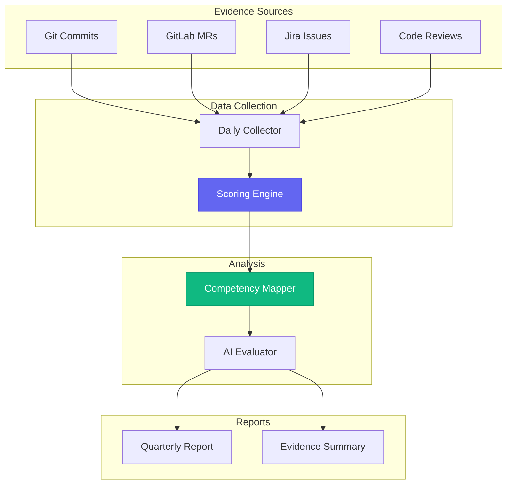
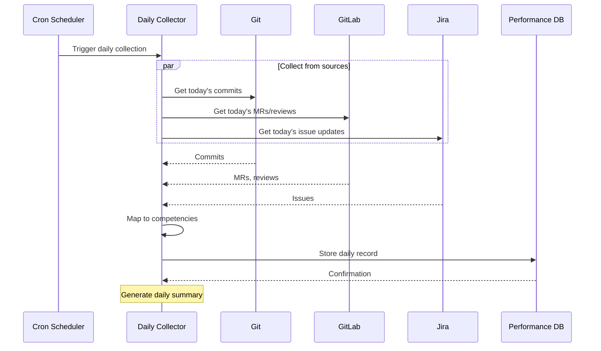
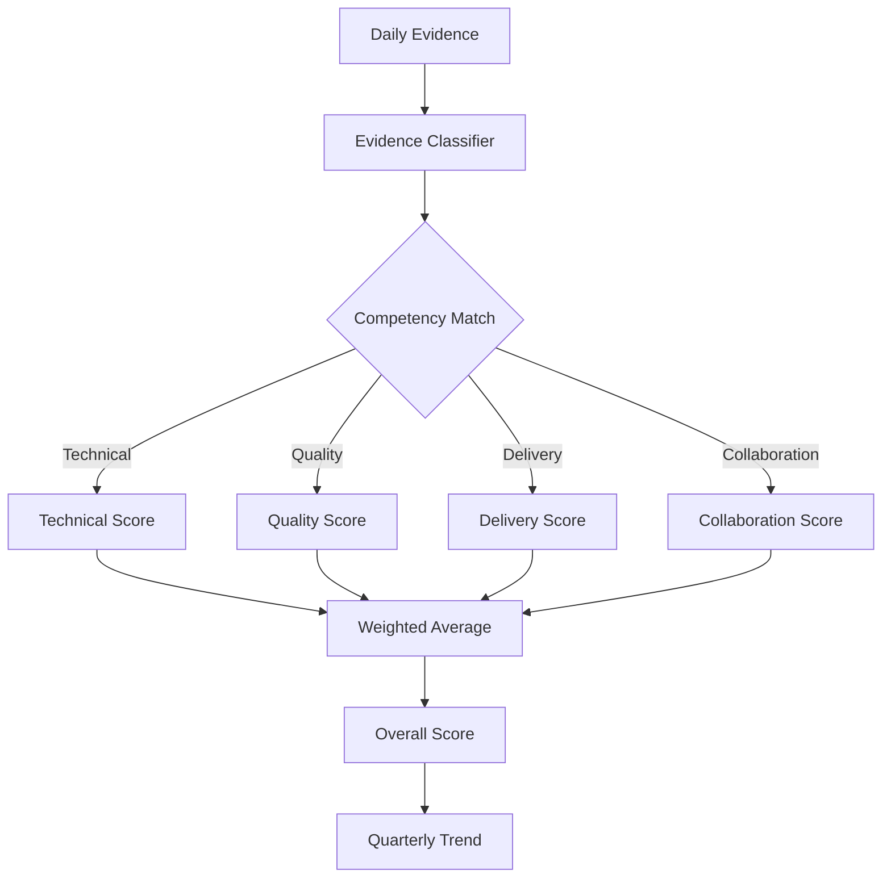
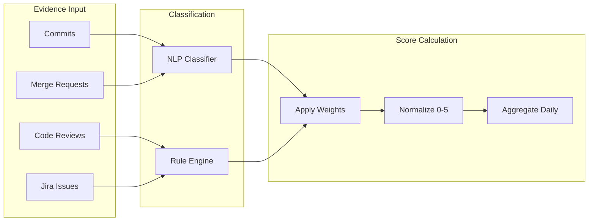
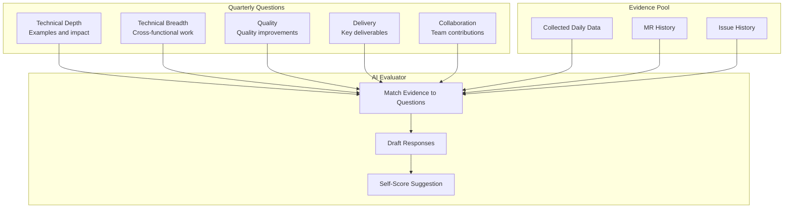
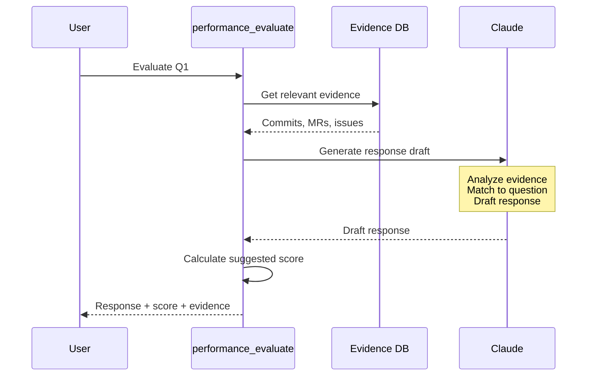
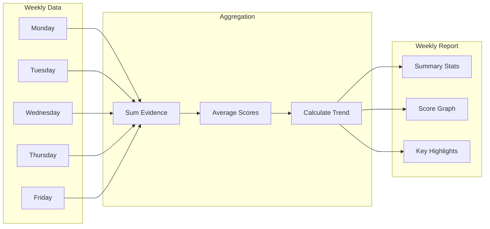

# 📊 Performance Module (aa_performance)

Performance tracking and PSE (Professional Software Engineer) competency scoring for self-assessment and quarterly reviews.

## Overview

The Performance module provides:
- **Daily performance data collection**: Track accomplishments and evidence
- **PSE competency mapping**: Map work to Red Hat competencies
- **Quarterly evaluation**: Answer evaluation questions with AI assistance
- **Evidence aggregation**: Collect commits, MRs, reviews as evidence

## Architecture



## PSE Competencies

The module tracks work against PSE (Professional Software Engineer) competencies:

| Competency | Description | Example Evidence |
|------------|-------------|------------------|
| **Technical Depth** | Deep expertise in core technologies | Complex bug fixes, architecture decisions |
| **Technical Breadth** | Knowledge across multiple areas | Cross-team contributions, new tech adoption |
| **Quality** | Commitment to code quality | Test coverage, code reviews, documentation |
| **Delivery** | Consistent delivery of results | Sprint completion, on-time releases |
| **Collaboration** | Working effectively with others | MR reviews, mentoring, team support |
| **Communication** | Clear technical communication | Documentation, presentations, issue descriptions |

## Tools

### Daily Collection

| Tool | Description |
|------|-------------|
| `performance_collect_daily` | Collect today's work data |
| `performance_get_daily` | Get daily performance summary |
| `performance_backfill` | Backfill missing daily data |

### Competency Scoring

| Tool | Description |
|------|-------------|
| `performance_score` | Calculate competency scores |
| `performance_map_evidence` | Map evidence to competencies |
| `performance_get_scores` | Get current competency scores |

### Quarterly Evaluation

| Tool | Description |
|------|-------------|
| `performance_evaluate` | AI-assisted question evaluation |
| `performance_export_report` | Export quarterly report |
| `performance_get_questions` | Get quarterly evaluation questions |

## Data Flow

### Daily Collection Flow



### Scoring Flow



## Scoring Engine

The scoring engine evaluates evidence and calculates competency scores:



### Scoring Criteria

| Evidence Type | Base Weight | Multipliers |
|---------------|-------------|-------------|
| Commit | 1.0 | +0.5 for tests, +0.3 for docs |
| MR Created | 2.0 | +1.0 if merged same day |
| MR Review | 1.5 | +0.5 for thorough review |
| Issue Completed | 2.0 | +0.5 per story point |
| Code Review Given | 1.0 | +0.5 for detailed comments |

## Quarterly Evaluation

### Question Structure



### AI-Assisted Evaluation



## Configuration

### config.json Settings

```json
{
  "performance": {
    "enabled": true,
    "collection_time": "18:00",
    "competencies": [
      "technical_depth",
      "technical_breadth",
      "quality",
      "delivery",
      "collaboration",
      "communication"
    ],
    "scoring": {
      "commit_weight": 1.0,
      "mr_weight": 2.0,
      "review_weight": 1.5,
      "issue_weight": 2.0
    }
  }
}
```

## State Management

### Daily Records

```yaml
# memory/state/performance/2026-01-26.yaml
date: 2026-01-26
commits:
  - repo: automation-analytics-backend
    sha: abc123
    message: "fix(billing): correct vCPU calculation"
    files_changed: 3
    competencies: [technical_depth, quality]

merge_requests:
  - project: automation-analytics-backend
    mr_id: 1459
    title: "Add billing export feature"
    status: merged
    competencies: [delivery, technical_depth]

reviews:
  - project: automation-analytics-frontend
    mr_id: 892
    comments: 5
    competencies: [collaboration, quality]

scores:
  technical_depth: 3.5
  quality: 4.0
  delivery: 3.0
  collaboration: 2.5
```

### Quarterly Summary

```yaml
# memory/state/performance/q1-2026.yaml
quarter: Q1 2026
period:
  start: 2026-01-01
  end: 2026-03-31

totals:
  commits: 156
  merge_requests: 23
  reviews_given: 45
  issues_completed: 18

competency_averages:
  technical_depth: 3.8
  technical_breadth: 3.2
  quality: 4.1
  delivery: 3.5
  collaboration: 3.9
  communication: 3.4

highlights:
  - "Implemented billing export feature (AAP-12345)"
  - "Led code review initiative for backend team"
  - "Mentored new team member on deployment process"
```

## Skill Integration

The performance module is used by scheduled skills:

```yaml
# skills/performance/collect_daily.yaml
name: collect_daily_performance
description: Collect daily performance data
trigger: scheduled
schedule: "0 18 * * 1-5"  # 6 PM weekdays

steps:
  - name: collect_commits
    tool: git_log
    args:
      since: today

  - name: collect_mrs
    tool: gitlab_mr_list
    args:
      author: me
      updated_after: today

  - name: store_daily
    tool: performance_collect_daily
    args:
      commits: "{{ steps.collect_commits.output }}"
      mrs: "{{ steps.collect_mrs.output }}"
```

## Reports

### Weekly Summary



### Export Formats

| Format | Description | Use Case |
|--------|-------------|----------|
| YAML | Machine-readable | Backup, automation |
| Markdown | Human-readable | Self-review |
| HTML | Formatted report | Manager sharing |
| JSON | API-compatible | Integration |

## See Also

- [Scheduler Module](./scheduler.md)
- [Git Module](./git.md)
- [GitLab Module](./gitlab.md)
- [Jira Module](./jira.md)
