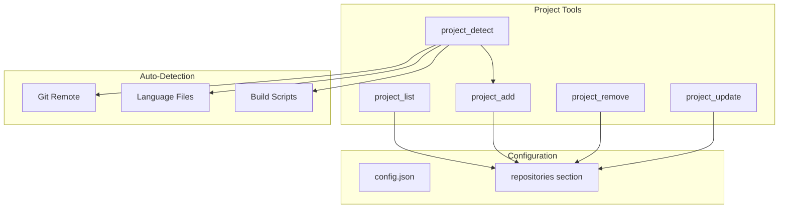
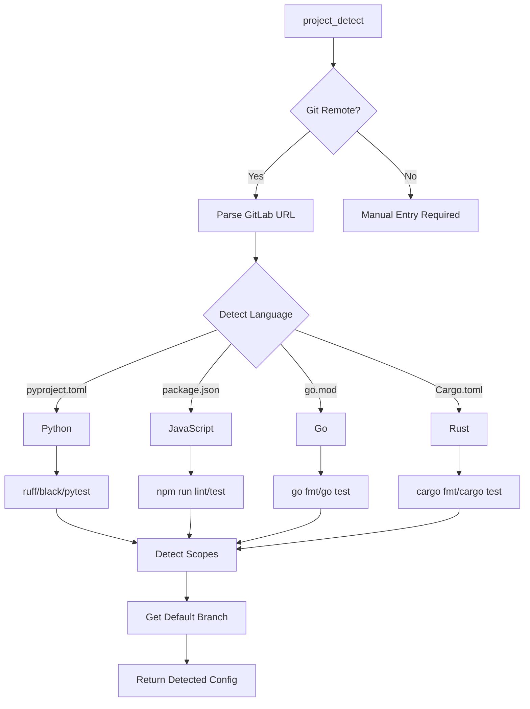

# Project Tools (aa_project)

Project configuration management in config.json.

## Overview

The Project module manages the `repositories` section of `config.json`, enabling dynamic addition, removal, and auto-detection of project settings.

## Tools (5 total)

| Tool | Description |
|------|-------------|
| `project_list` | List all configured projects with their settings |
| `project_add` | Add a new project to config.json |
| `project_remove` | Remove a project from config.json |
| `project_detect` | Auto-detect project settings from a directory |
| `project_update` | Update an existing project's settings |

## Architecture



## Project Configuration Schema

Each project in `config.json` has these fields:

```json
{
  "repositories": {
    "automation-analytics-backend": {
      "path": "/home/user/src/automation-analytics-backend",
      "gitlab": "insights-platform/automation-analytics-backend",
      "jira_project": "AAP",
      "jira_component": "Tower Analytics",
      "default_branch": "main",
      "lint_command": "make lint",
      "test_command": "make test",
      "test_setup": "docker-compose up -d && make migrations",
      "konflux_namespace": "rhtap-build-tenant",
      "scopes": ["api", "billing", "worker", "tests", "docs"]
    }
  }
}
```

### Field Descriptions

| Field | Required | Description |
|-------|----------|-------------|
| `path` | Yes | Local filesystem path to the project |
| `gitlab` | Yes | GitLab project path (org/repo) |
| `jira_project` | Yes | Jira project key (e.g., "AAP") |
| `default_branch` | Yes | Default branch (main/master) |
| `jira_component` | No | Jira component for filtering |
| `lint_command` | No | Command to run linting |
| `test_command` | No | Command to run tests |
| `test_setup` | No | Setup before running tests |
| `konflux_namespace` | No | Konflux tenant namespace |
| `scopes` | No | Commit message scopes |
| `docs` | No | Link to project documentation |

## Common Usage

### List All Projects

```python
project_list()

# Output:
# ## Configured Projects
#
# ### automation-analytics-backend
# - **Path:** /home/user/src/automation-analytics-backend ✅
# - **GitLab:** insights-platform/automation-analytics-backend
# - **Jira:** AAP (Tower Analytics)
# - **Default Branch:** main
# - **Scopes:** api, billing, worker, tests, docs
```

### Auto-Detect and Add Project

```python
# First detect settings
project_detect(path="/home/user/src/my-new-project")

# Output shows detected settings, then:
project_add(
    name="my-new-project",
    path="/home/user/src/my-new-project",
    gitlab="my-org/my-new-project",
    jira_project="PROJ",
    auto_detect=True  # Apply detected settings
)
```

### Add Project Manually

```python
project_add(
    name="my-project",
    path="/home/user/src/my-project",
    gitlab="org/my-project",
    jira_project="AAP",
    jira_component="My Component",
    lint_command="make lint",
    test_command="pytest",
    scopes="api,tests,docs"
)
```

### Update Project Settings

```python
project_update(
    name="my-project",
    lint_command="ruff check .",
    test_command="pytest -xvs"
)
```

### Remove Project

```python
# Requires confirmation
project_remove(name="old-project", confirm=True)
```

## Auto-Detection Logic



### Detected Settings

| Source | Detected Setting |
|--------|------------------|
| `.git/config` | GitLab URL, default branch |
| `pyproject.toml` | Python project, lint/test commands |
| `package.json` | JS project, npm scripts |
| `go.mod` | Go project |
| `Makefile` | Available make targets |
| Directory structure | Commit scopes |

## Skill Integration

Project tools are used by these skills:

| Skill | Project Tools Used |
|-------|-------------------|
| `add_project` | project_detect, project_add |
| `remove_project` | project_remove |
| `bootstrap_knowledge` | project_list |
| `start_work` | Uses project config for context |

## Related Commands

- `/add-project` - Add a new project
- `/list-projects` - List configured projects
- `/detect-project` - Auto-detect settings
- `/remove-project` - Remove a project

## See Also

- [Project Configuration](../DEVELOPMENT.md#project-configuration)
- [Add Project Skill](../skills/add_project.md)
- [Knowledge System](./knowledge.md)
