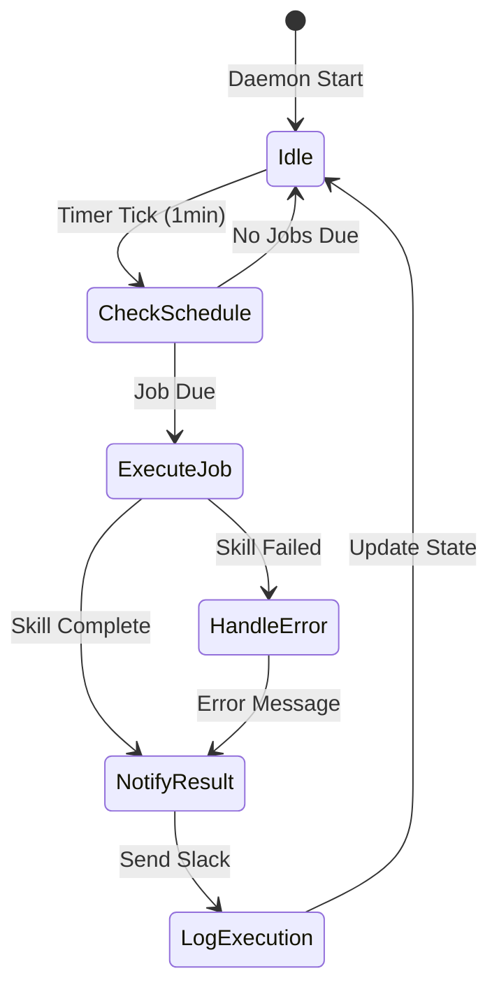
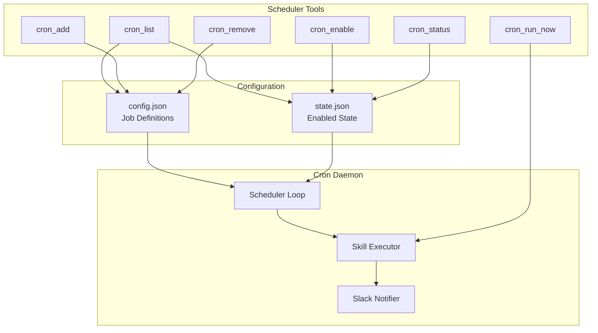

# Scheduler Tools (aa_scheduler)

Cron-style job scheduling for automated skill execution.

## Overview

The Scheduler module enables automated, time-based execution of skills. Jobs are defined in `config.json` and their enabled state is managed in `state.json`. The actual execution is handled by the Cron Daemon.

## Tools (7 total)

| Tool | Description |
|------|-------------|
| `cron_list` | List all scheduled jobs with next run time |
| `cron_add` | Add a new scheduled job |
| `cron_remove` | Remove a scheduled job |
| `cron_enable` | Enable or disable a job |
| `cron_run_now` | Manually trigger a scheduled job |
| `cron_status` | Show scheduler status and recent executions |
| `cron_scheduler_toggle` | Enable/disable the entire scheduler |

## Architecture





## Job Definition

Jobs are defined in `config.json` under the `schedules` section:

```json
{
  "schedules": {
    "timezone": "America/New_York",
    "jobs": [
      {
        "name": "morning_coffee",
        "skill": "coffee",
        "cron": "0 9 * * 1-5",
        "notify": ["#dev-channel"],
        "persona": "developer",
        "inputs": {
          "days_back": 1
        }
      },
      {
        "name": "daily_standup",
        "skill": "standup_summary",
        "cron": "0 9 30 * * 1-5",
        "notify": ["#team-standups"]
      }
    ]
  }
}
```

### Job Fields

| Field | Required | Description |
|-------|----------|-------------|
| `name` | Yes | Unique job identifier |
| `skill` | Yes | Skill to execute |
| `cron` | Yes | Cron expression (5-field or 6-field) |
| `notify` | No | Slack channels for notifications |
| `persona` | No | Persona to use for execution |
| `inputs` | No | Input parameters for the skill |

## Common Usage

### List Scheduled Jobs

```python
cron_list()
# Returns:
# ## 📅 Scheduled Jobs
# **Timezone:** America/New_York
#
# ### ✅ morning_coffee
# **Skill:** `coffee`
# **Schedule:** 0 9 * * 1-5 (Every weekday at 9:00 AM)
# **Next Run:** 2026-01-27 09:00:00
```

### Add a New Job

```python
cron_add(
    name="weekly_review",
    skill="weekly_summary",
    cron="0 17 * * 5",  # Every Friday at 5 PM
    notify=["#team-channel"]
)
```

### Enable/Disable Jobs

```python
# Disable a job
cron_enable(name="morning_coffee", enabled=False)

# Re-enable
cron_enable(name="morning_coffee", enabled=True)
```

### Manual Trigger

```python
# Run a job immediately
cron_run_now(name="morning_coffee")
```

## Cron Expression Format

Standard 5-field cron format:

```
┌───────────── minute (0-59)
│ ┌───────────── hour (0-23)
│ │ ┌───────────── day of month (1-31)
│ │ │ ┌───────────── month (1-12)
│ │ │ │ ┌───────────── day of week (0-6, 0=Sunday)
│ │ │ │ │
* * * * *
```

**Examples:**
- `0 9 * * 1-5` - 9 AM on weekdays
- `*/15 * * * *` - Every 15 minutes
- `0 0 1 * *` - First of every month at midnight
- `0 17 * * 5` - Every Friday at 5 PM

## State Management

Job enabled state is stored separately from job definitions:

```json
// state.json
{
  "scheduler": {
    "enabled": true,
    "jobs": {
      "morning_coffee": {"enabled": true},
      "weekly_review": {"enabled": false}
    }
  }
}
```

This separation allows:
- Job definitions in version control (config.json)
- Runtime state persisted separately (state.json)
- Easy enable/disable without modifying config

## See Also

- [Cron Daemon](../daemons/cron.md) - Background scheduler service
- [Skills Reference](../skills/README.md) - Available skills for scheduling
- [Coffee Skill](../skills/coffee.md) - Example scheduled skill
