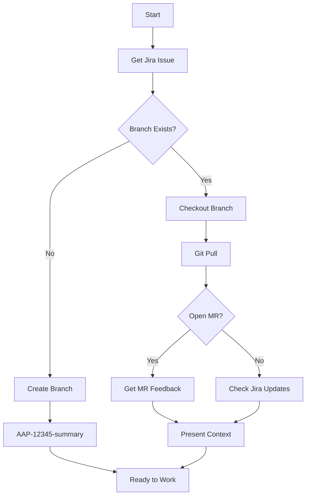
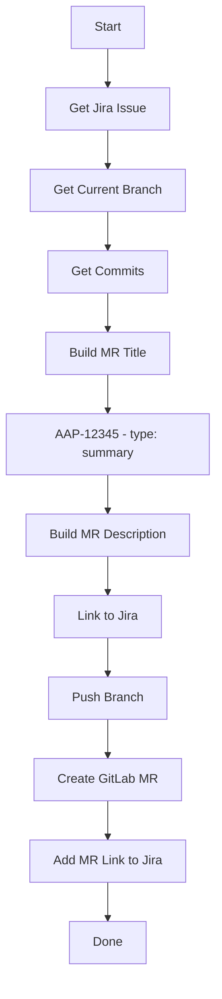
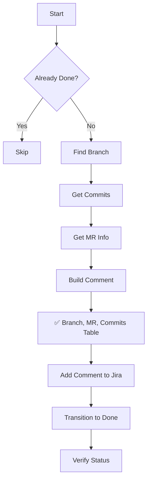
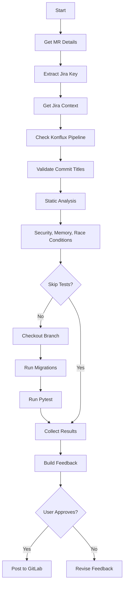
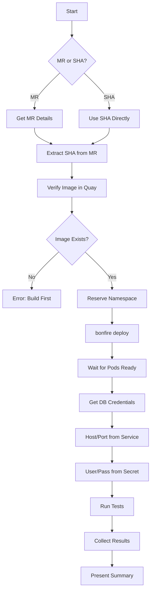
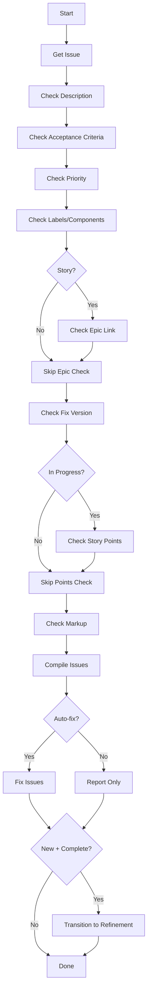
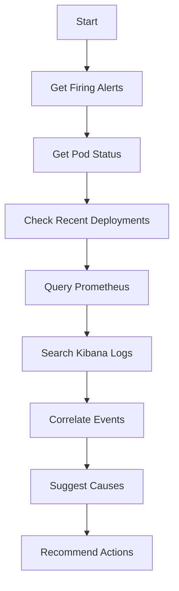
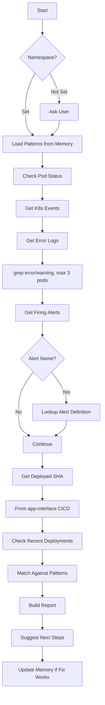
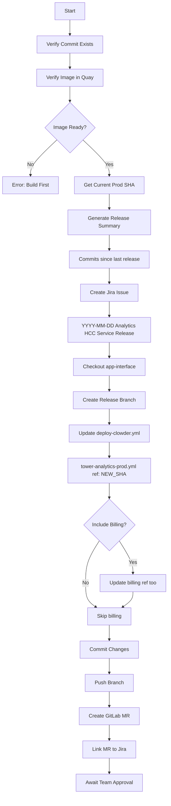

# Skills

Skills are reusable workflows that combine multiple MCP tools with decision logic.
They can be invoked by agents or directly by the user.

## Quick Reference

| Skill | Purpose | Agent |
|-------|---------|-------|
| [`start_work`](#start_work) | Begin work on a Jira issue | developer |
| [`create_mr`](#create_mr) | Create MR with proper format | developer |
| [`close_issue`](#close_issue) | Close issue with commit summary | developer |
| [`review_pr`](#review_pr) | Review colleague's PR | developer |
| [`test_mr_ephemeral`](#test_mr_ephemeral) | Test in ephemeral namespace | developer |
| [`jira_hygiene`](#jira_hygiene) | Validate/fix Jira quality | developer |
| [`investigate_alert`](#investigate_alert) | Investigate firing alerts | devops, incident |
| [`debug_prod`](#debug_prod) | Debug production issues | devops, incident |
| [`release_aa_backend_prod`](#release_aa_backend_prod) | Release to production | release |

---

## Skill Details

### start_work

Begin work on a Jira issue - creates branch, sets up context, or resumes existing work.

```
skill_run("start_work", '{"issue_key": "AAP-12345"}')
```

**Inputs:**
| Input | Required | Default | Description |
|-------|----------|---------|-------------|
| `issue_key` | Yes | - | Jira issue key (e.g., AAP-12345) |
| `repo` | No | `.` | Repository path |



---

### create_mr

Create a Merge Request with proper formatting, linked to Jira.

```
skill_run("create_mr", '{"issue_key": "AAP-12345"}')
```

**Inputs:**
| Input | Required | Default | Description |
|-------|----------|---------|-------------|
| `issue_key` | Yes | - | Jira issue key |
| `repo` | No | `.` | Repository path |
| `draft` | No | `false` | Create as draft MR |



---

### close_issue

Close a Jira issue with a summary of completed work from commits.

```
skill_run("close_issue", '{"issue_key": "AAP-12345"}')
```

**Inputs:**
| Input | Required | Default | Description |
|-------|----------|---------|-------------|
| `issue_key` | Yes | - | Jira issue key |
| `repo` | No | `.` | Repository path |
| `add_comment` | No | `true` | Add closing comment |



---

### review_pr

Review a colleague's PR with static analysis and local testing.

```
skill_run("review_pr", '{"mr_id": 123}')
```

**Inputs:**
| Input | Required | Default | Description |
|-------|----------|---------|-------------|
| `mr_id` | Yes | - | GitLab MR ID |
| `skip_tests` | No | `false` | Skip local tests |



---

### test_mr_ephemeral

Test an MR image in an ephemeral Kubernetes namespace.

```
skill_run("test_mr_ephemeral", '{"mr_id": 123}')
skill_run("test_mr_ephemeral", '{"commit_sha": "abc123"}')
```

**Inputs:**
| Input | Required | Default | Description |
|-------|----------|---------|-------------|
| `mr_id` | No* | - | GitLab MR ID |
| `commit_sha` | No* | - | Commit SHA to test |
| `duration` | No | `2h` | Namespace duration |
| `billing` | No | `false` | Include billing component |

*One of `mr_id` or `commit_sha` required



---

### jira_hygiene

Validate and fix Jira issue quality - descriptions, acceptance criteria, links.

```
skill_run("jira_hygiene", '{"issue_key": "AAP-12345"}')
skill_run("jira_hygiene", '{"issue_key": "AAP-12345", "auto_fix": true}')
```

**Inputs:**
| Input | Required | Default | Description |
|-------|----------|---------|-------------|
| `issue_key` | Yes | - | Jira issue key |
| `auto_fix` | No | `false` | Auto-fix issues |
| `auto_transition` | No | `false` | Auto-transition New→Refinement |



**Checks Performed:**
- ✅ Has description (not empty)
- ✅ Has acceptance criteria
- ✅ Priority is set
- ✅ Has labels/components
- ✅ Linked to epic (stories only)
- ✅ Has fix version
- ✅ Story points (if In Progress)
- ✅ Proper Jira markup

---

### investigate_alert

Investigate a firing Prometheus alert.

```
skill_run("investigate_alert", '{"environment": "production"}')
skill_run("investigate_alert", '{"environment": "stage", "alert_name": "HighErrorRate"}')
```

**Inputs:**
| Input | Required | Default | Description |
|-------|----------|---------|-------------|
| `environment` | Yes | - | `production` or `stage` |
| `alert_name` | No | - | Specific alert to investigate |



---

### debug_prod

Comprehensive production debugging with memory-backed pattern matching.

```
skill_run("debug_prod", '{"namespace": "main"}')
skill_run("debug_prod", '{"namespace": "billing", "alert_name": "HighLatency"}')
```

**Inputs:**
| Input | Required | Default | Description |
|-------|----------|---------|-------------|
| `namespace` | No | asks | `main` or `billing` |
| `alert_name` | No | - | Prometheus alert name |
| `pod_filter` | No | - | Filter pods by name |
| `time_range` | No | `1h` | How far back (15m, 1h, 6h, 24h) |



**Locations Checked:**
- Pod status: CrashLoopBackOff, OOMKilled, restarts
- Events: warnings, errors
- Logs: filtered for errors (truncated)
- Alert definitions: `app-interface/resources/insights-prod/`
- CICD config: `app-interface/data/services/insights/tower-analytics/cicd/`
- Namespace config: `app-interface/data/services/insights/tower-analytics/namespaces/`

---

### release_aa_backend_prod

Release Automation Analytics backend to production via app-interface.

```
skill_run("release_aa_backend_prod", '{"commit_sha": "abc123def456"}')
```

**Inputs:**
| Input | Required | Default | Description |
|-------|----------|---------|-------------|
| `commit_sha` | Yes | - | Commit SHA to release |
| `release_date` | No | today | Release date for Jira |
| `include_billing` | No | `false` | Also update billing namespace |



**Files Modified:**
```
app-interface/data/services/insights/tower-analytics/cicd/deploy-clowder.yml
```

---

## How Skills Work

1. **Skill Definition** - YAML file describing inputs, steps, and outputs
2. **Tool Composition** - Combines multiple MCP tools in sequence
3. **Decision Points** - Conditional logic based on tool outputs
4. **Compute Blocks** - Python code for data transformation
5. **Memory Integration** - Learn from past runs

## Skill Format

```yaml
name: skill_name
description: What this skill does
version: "1.0"

inputs:
  - name: input_name
    type: string
    required: true
    description: "What this input is for"

constants:
  some_value: "constant data"

steps:
  - name: step_one
    tool: tool_name
    args:
      param: "{{ inputs.input_name }}"
    output: step1_result

  - name: step_two
    condition: "{{ step1_result.success }}"
    compute: |
      # Python code here
      result = {"processed": step1_result.data}
    output: step2_result

  - name: step_three
    condition: "{{ not step2_result.processed }}"
    tool: fallback_tool
    on_error: continue

outputs:
  - name: summary
    value: |
      ## Results
      {{ step2_result | json }}
```

## Usage

**In chat:**
```
Run skill: start_work with issue AAP-12345
```

**Via tool:**
```
skill_run("start_work", '{"issue_key": "AAP-12345"}')
```

**From agent:**
```
Use the investigate_alert skill to check what's happening in production
```
